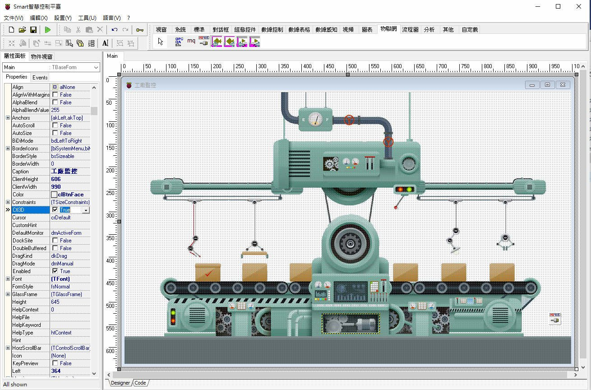
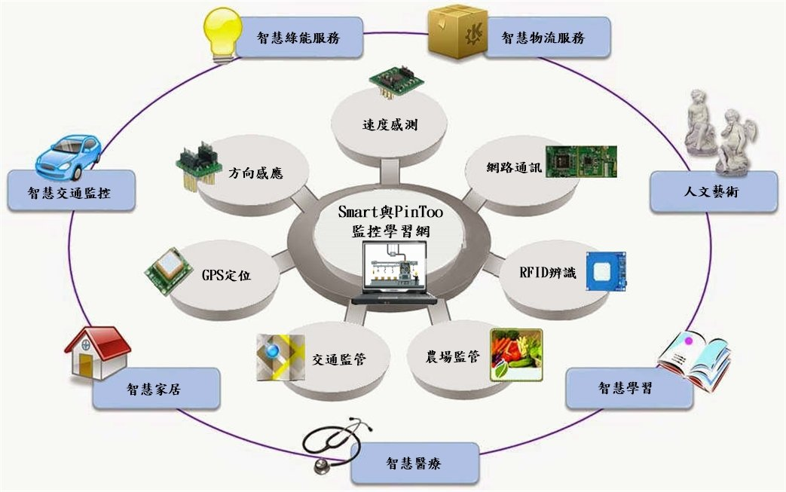
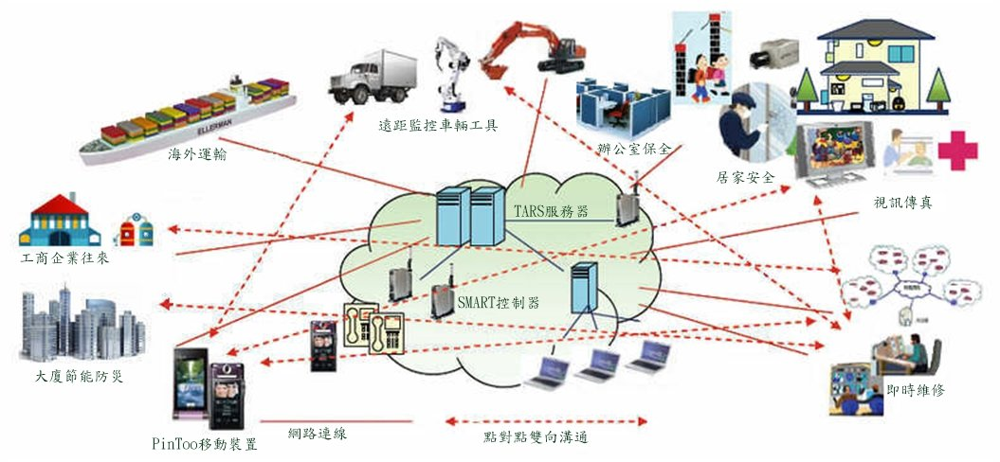
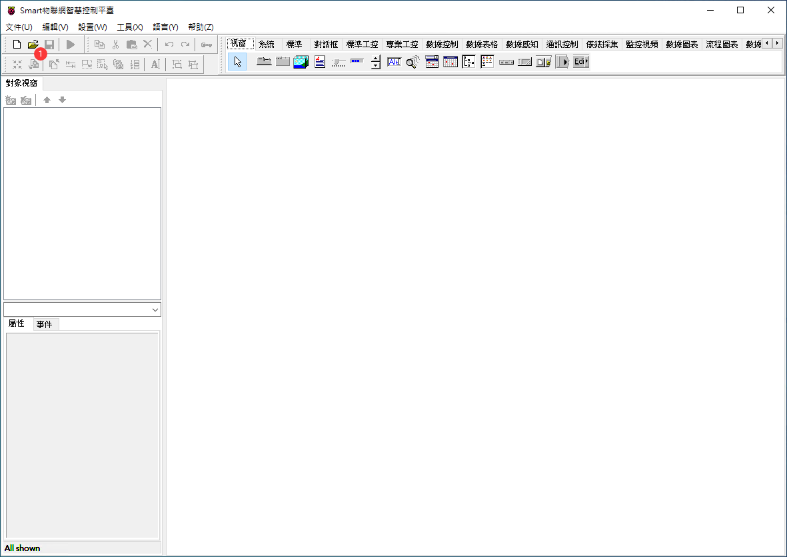
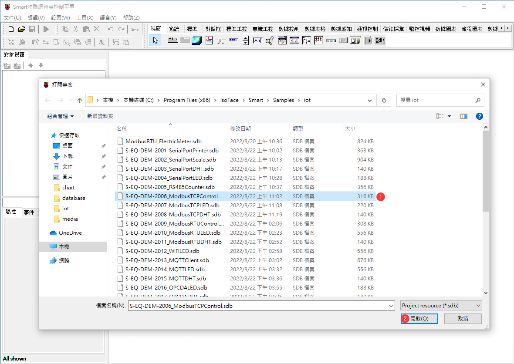
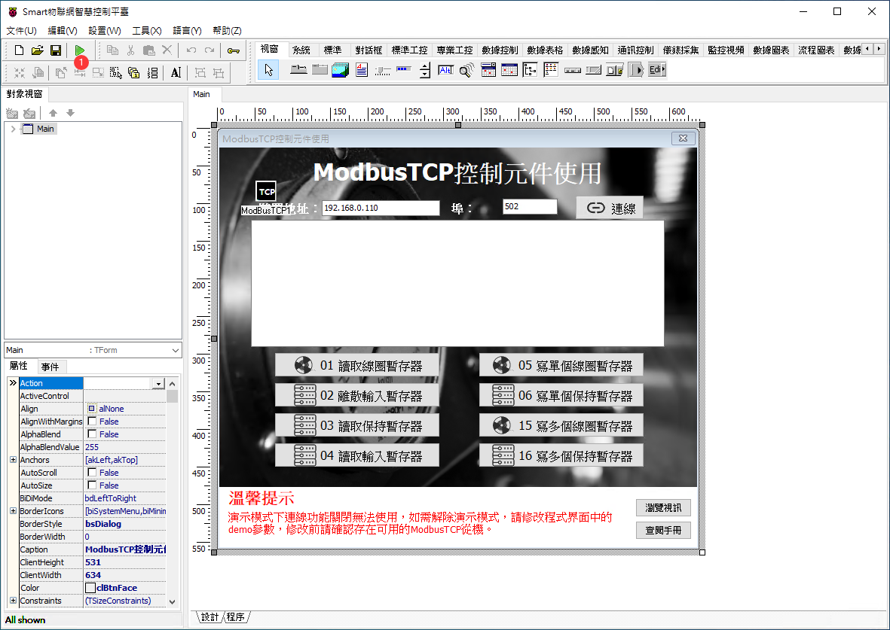

# Smart 是 Windows 平臺，物聯網軟體的開發工具
Smart 智慧控制平臺，實現集中監控、資訊共用、智慧控制，與 ERP 企業經營管理系統協調互動。社區版非商業用途可免費使用。

> **加入 Facebook 社團**
>
> [https://www.facebook.com/groups/isoface/](https://www.facebook.com/groups/isoface/)
> 
> **點讚追蹤 Facebook 粉絲專頁**
> 
> [https://www.facebook.com/AIOT.ERP](https://www.facebook.com/AIOT.ERP)

Smart 是資料採集與監控系統。提供多層次開發框架，快速開發企業管理系統，只要有網路，無論何時、何地，都可以自行開發、快速的工作。從系統設計、雛型設計到系統開發，最後到版本管理與佈署一氣呵成，顛覆軟體設計工作模式，並提供全新服務。Smart專為Windows平臺設計的圖像化編程工具。以您為中心，量身打造Smart各種商業運用與物聯網的整合。無論在工廠監控、ERP、電子商務…，就讓Smart滿足您的想像。

Smart 適用於自動化設備動態圖形顯示和即時資料掌控。Smart在各行業廣泛的應用，包括航太航空、軍工、汽車、農業、能源、電源管控、樓宇管理、一般製造工廠、礦山、食品和飲料生產、科研、以及教育。Smart綜合了SCADA、HMI、與動態儀表的各項優點，具有優良靈活的性能，更高的性價比。Smart即時線上程式設計能力和高速採集和記錄資料能力，是物聯網聰明的精靈。

## 範例目錄

範例目錄的說明如下：

### 物聯網

|目錄名稱|對應範例名稱|
|-------|------------|
|[s-eq-dem-2001_serialportprinter](demo/iot/s-eq-dem-2001_serialportprinter/)|通訊埠印表機|
|[s-eq-dem-2002_serialportsscale](demo/iot/s-eq-dem-2002_serialportsscale/)|通訊埠電子秤|
|[s-eq-dem-2003_serialportdht](demo/iot/s-eq-dem-2003_serialportdht/)|通訊埠讀取溫濕度|
|[s-eq-dem-2004_serialportled](demo/iot/s-eq-dem-2004_serialportled/)|通訊埠控制 LED 燈|
|[s-eq-dem-2005_rs485counter](demo/iot/s-eq-dem-2005_rs485counter/)|RS485 計數器|
|[s-eq-dem-2006_modbustcpcontrol](demo/iot/s-eq-dem-2006_modbustcpcontrol/)|ModbusTCP 控制元件使用|
|[s-eq-dem-2007_modbustcpled](demo/iot/s-eq-dem-2007_modbustcpled/)|ModbusTCP 控制 LED 燈|
|[s-eq-dem-2008_modbustcpdht](demo/iot/s-eq-dem-2008_modbustcpdht/)| ModbusTCP 讀取溫濕度|
|[s-eq-dem-2009_modbusrtucontrol](demo/iot/s-eq-dem-2009_modbusrtucontrol/)| ModbusRTU 控制元件使用|
|[s-eq-dem-2010_modbusrtuled](demo/iot/s-eq-dem-2010_modbusrtuled/)| ModbusRTU 控制 LED 燈|
|[s-eq-dem-2011_modbusrtudht](demo/iot/s-eq-dem-2011_modbusrtudht/)|ModbusRTU 讀取溫濕度|
|[s-eq-dem-2012_wifiled](demo/iot/s-eq-dem-2012_wifiled/)|WiFi 控制 LED 燈|
|[s-eq-dem-2013_mqttclient](demo/iot/s-eq-dem-2013_mqttclient/)| MQTT 控制元件使用|
|[s-eq-dem-2014_mqttled](demo/iot/s-eq-dem-2014_mqttled/)|MQTT 控制 LED 燈|
|[s-eq-dem-2015_mqttdht](demo/iot/s-eq-dem-2015_mqttdht/)| MQTT 讀取溫濕度|
|[s-eq-dem-2016_opcdaled](demo/iot/s-eq-dem-2016_opcdaled/)| OPCDA 控制 LED 燈|
|[s-eq-dem-2017_opcdadht](demo/iot/s-eq-dem-2017_opcdadht/)| OPCDA 讀取溫濕度|
|[s-eq-dem-2018_bluetoothscale](demo/iot/s-eq-dem-2018_bluetoothscale/)| 藍芽電子秤|
|[s-eq-dem-2019_bluetoothled](demo/iot/s-eq-dem-2019_bluetoothled/)|藍芽控制 LED 燈|
|[s-eq-dem-2020_bluetoothdht](demo/iot/s-eq-dem-2020_bluetoothdht/)| 藍芽讀取溫濕度|
|[s-eq-dem-2043_restapiled](demo/iot/s-eq-dem-2043_restapiled/)|RestAPI 控制 LED 燈|
|[s-eq-dem-2044_restapidht](demo/iot/s-eq-dem-2044_restapidht/)|RestAPI 讀取溫濕度|
|[s-eq-dem-2048_dlt645meter](demo/iot/s-eq-dem-2048_dlt645meter/)|智慧電錶採集|
|[s-eq-dem-2049_dhtcontrol](demo/iot/s-eq-dem-2049_dhtcontrol/)|溫濕度採集與控制|
|[s-eq-dem-2201_translation_robotic_arm](demo/iot/s-eq-dem-2201_translation_robotic_arm/)|機械臂|
|[s-eq-dem-2202_esp32cam_slider](demo/iot/s-eq-dem-2202_esp32cam_slider/)|ESP32CAM軌道照相機|
|[s-eq-dem-2203_esp32_slider](demo/iot/s-eq-dem-2203_esp32_slider/)|ESP32軌道照相機|
|[s-eq-dem-2208_modbusrtuelecmeter](demo/iot/s-eq-dem-2208_modbusrtuelecmeter/)|ModbusRTU 電錶數據採集|
|[s-eq-dem-2209_rfid_mqtt_relay](demo/iot/s-eq-dem-2209_rfid_mqtt_relay/)|RFID刷卡裝置|
|[s-eq-dem-2211_pms5003st_sensor](demo/iot/s-eq-dem-2211_pms5003st_sensor/)|PM2.5 感測器數據讀取|
|[s-eq-dem-2213_comport_elecmeter](demo/iot/s-eq-dem-2213_comport_elecmeter/)|通訊埠電錶數據採集|

### 媒體

|目錄名稱|對應範例名稱|
|-------|------------|
|[s-eq-dem-2021_onlinedocument](demo/media/s-eq-dem-2021_onlinedocument/)| 網路文件瀏覽|
|[s-eq-dem-2022_videoplayer](demo/media/s-eq-dem-2022_videoplayer)|視訊播放|
|[s-eq-dem-2031_formtransfer](demo/media/s-eq-dem-2031_formtransfer/)| 窗體相互傳值|
|[s-eq-dem-2032_qrscan](demo/media/s-eq-dem-2032_qrscan/)|二維碼掃瞄與二維碼產生|
|[s-eq-dem-2034_ocr](demo/media/s-eq-dem-2034_ocr/)|OCR 識別|
|[s-eq-dem-2036_networkcamera](demo/media/s-eq-dem-2036_networkcamera/)|網路攝像機伺服器、網路攝像機客戶端|
|[s-eq-dem-2038_videorecoder](demo/media/s-eq-dem-2038_videorecoder/)|視訊錄影|
|[s-eq-dem-2039_livepush](demo/media/s-eq-dem-2039_livepush/)|視訊推流|
|[s-eq-dem-2040_handwriting](demo/media/s-eq-dem-2040_handwriting/)|智慧手寫板|
|[s-eq-dem-2046_vncview](demo/media/s-eq-dem-2046_vncview/)| 遠端桌面控制伺服器、遠端桌面控制客戶端|
|[s-eq-dem-2052_email](demo/media/s-eq-dem-2052_email/)|郵件發送|
|[s-eq-dem-2053_chatroom](demo/media/s-eq-dem-2053_chatroom/)|網路聊天室|
|[s-eq-dem-2214_openmap](demo/media/s-eq-dem-2214_openmap/)|地圖定位展示|

### AI

|目錄名稱|對應範例名稱|
|-------|------------|
|[s-eq-dem-2041_ttsplayer](demo/ai/s-eq-dem-2041_ttsplayer/)|語音播報|

### 圖表

|目錄名稱|對應範例名稱|
|-------|------------|
|[s-eq-dem-2023_chartdemo](demo/chart/s-eq-dem-2023_chartdemo/)|圖表展示|
|[s-eq-dem-2025_charts](demo/chart/s-eq-dem-2025_charts/)|ECharts 圖表展示|

### 資料庫

|目錄名稱|對應範例名稱|
|-------|------------|
|[s-eq-dem-2026_tars](demo/database/s-eq-dem-2026_tars/)|TARS 數據存取|
|[s-eq-dem-2030_http](demo/database/s-eq-dem-2030_http/)|自定 HTTP Server 伺服器、自定 HTTP Client 客戶端|
|[s-eq-dem-2045_restapi](demo/database/s-eq-dem-2045_restapi/)| TARS RestAPI 應用|

### 訊息

|目錄名稱|對應範例名稱|
|-------|------------|
|[s-eq-dem-2028_smssender](demo/message/s-eq-dem-2028_smssender/)| 簡訊發送|

### 報表

|目錄名稱|對應範例名稱|
|-------|------------|
|[s-eq-dem-2024_reportdesign](demo/report/s-eq-dem-2024_reportdesign/)|報表設計|
|[s-eq-dem-2027_flying](demo/report/s-eq-dem-2027_flying/)|Flying 網路列印|

### 組態

|目錄名稱|對應範例名稱|
|-------|------------|
|[s-eq-dem-2051_svgscada](demo/scada/s-eq-dem-2051_svgscada/)| SVG 組態|
|[s-eq-dem-2204_filltank_openplc](demo/scada/s-eq-dem-2204_filltank_openplc/)|液化水槽監控(OpenPLC)|
|[s-eq-dem-2205_filltank_smart](demo/scada/s-eq-dem-2205_filltank_smart/)|液化水槽監控(Smart)|
|[s-eq-dem-2206_factory_robot](demo/scada/s-eq-dem-2206_factory_robot/)|工業手臂抓取物件|
|[s-eq-dem-2212_filltank_opcda](demo/scada/s-eq-dem-2212_filltank_opcda/)|液化水槽監控(OPCDA)|

* **Smart 簡介**：https://isoface.net/isoface/production/software/smart/smart
* **Smart 下載**：[點選此處下載](https://github.com/isoface-iot/Smart/releases/latest)
* **Smart 使用手冊**：https://isoface.net/isoface/doc/smart/main/
* **Smart 快速上手**：https://isoface.net/isoface/study/quick-start/2022-05-28-03-08-29/smart
* **無需安裝，Smart線上試用**：https://isoface.net/isoface/support/trial/smart

## 無需安裝，線上試用

建議使用 Chorme、Edge 等瀏覽器打開試用鏈接頁面。顯示的解析度不低於 1920 * 1080，以獲得更好的顯示效果。

Smart開發測試為協助開發者，測試IDE界面設計、瀏覽系統管理功能，修改結果不能儲存。其中部分示例由於演示環境限制不能完整執行，請查閱相應的示例說明搭建配套環境。

如果想要體驗Smart開發測試的相關內容，請點選下方的鏈接打開登錄頁面，在指定的位置輸入使用者名稱與密碼，進入到Smart開發測試的頁面中。由於Smart開發測試系統環境的許可權設定，點選左上角的打開圖示無法打開預設目錄下的文件，會彈出提示 **由於計算機的限制而被取消。請與您的系統管理員聯繫。** 此時可點選**確定**以繼續打開目錄，選擇目錄中`.sdb`後綴的文件。等待載入完成後，點選執行按鈕啟動執行測試。

[線上試用鏈接，點選此處會進行跳轉。](https://www.diylogi.com/)

登錄名：smart

密碼：demo

* Smart開發測試檢視模組開發界面與模組切換說明

如果已經打開了其他的模板文件，點選功能表欄中的`文件-關閉專案`來退出專案文件。如果是剛啟動的情況下可以忽略這個步驟。

在打開的Smart界面中，點選左上角的打開文件按鈕打開對話方塊。

在打開專案的對話方塊中，根據對應的編號選擇範例模板文件，然後點選`打開(O)`按鈕。

打開專案后，可檢視專案的界面與程式碼。點選執行按鈕，啟動模板檢視執行效果。詳情可檢視[Smart快速上手](https://isoface.net/isoface/study/quick-start/2022-05-28-03-08-29/smart)。

## 注意事項：
1. Smart智慧控制開發工具採用 Pascal 程序語言，開發物聯網相關運用。
2. Smart 因支援多種通訊協定與視訊處理程序，在 4K顯示器的設計模式下，字體顯示偏小，如不適應請先調整，4K顯示器解析度在 1920 * 1080 與 2560 * 1440 之間，不便之處敬請見諒。
