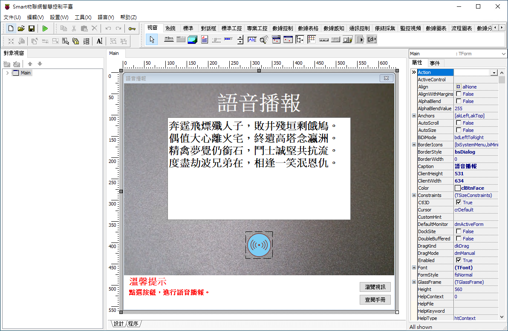
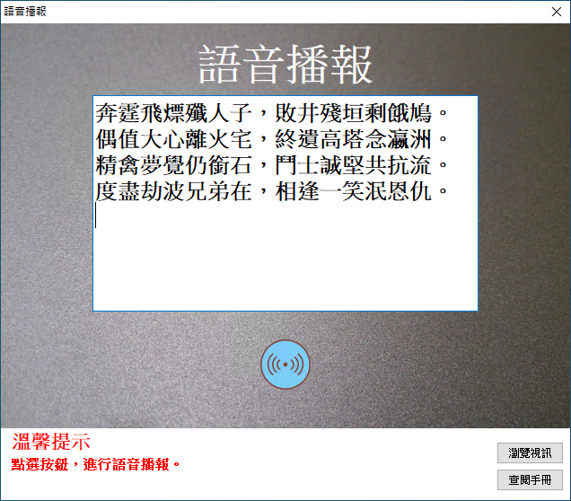
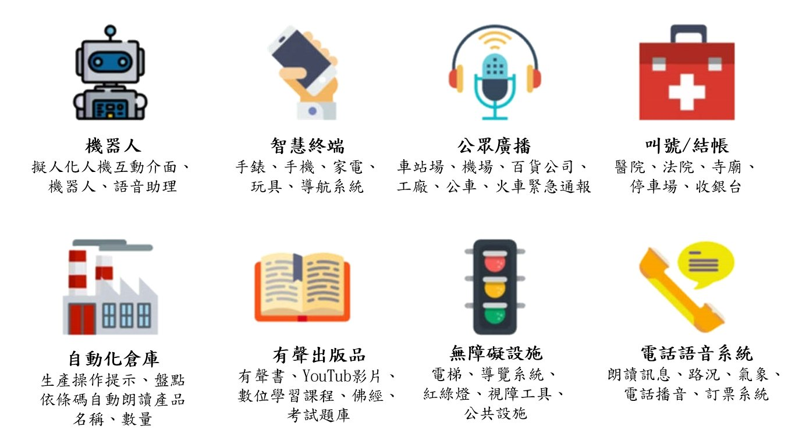

# 以聲音傳達真實感受，Smart 利用 AI 技術將文字轉換成語音

Smart 智慧控制平臺，實現集中監控、資訊共用、智慧控制，與 ERP 企業經營管理系統協調互動。社區版非商業用途可免費使用。

> **加入 Facebook 社團**
>
> [https://www.facebook.com/groups/isoface/](https://www.facebook.com/groups/isoface/)
> 
> **點讚追蹤 Facebook 粉絲專頁**
> 
> [https://www.facebook.com/AIOT.ERP](https://www.facebook.com/AIOT.ERP)

## 說明

Smart 文字轉語音功能，提供中文朗讀，讓用戶聽到自然且熟悉的聲音。它開朗愉快的朗讀，您自行輸入的文字訊息，以接近自然人聲，讓聽眾有好心情，可應用於文字閱讀、朗讀程式、客戶服務、聊天機器人。或者做影片時，有些人可能不喜歡錄自己的聲音，這時文字轉語音就是很不錯的輔助工具。Smart 開發設計可自然說話的應用程式與服務。使用者完全自訂，以逼真的語音產生器讓您的產品脫穎而出，讓 Smart 所開發的應用程式更生動。

## 用途
機器人、智慧終端、公眾廣播、叫號系統/結帳、工廠/倉儲自動、App、網站等數位內容製作、有聲出版品、無障礙設施與輔具、R電話語音系統。

　　
## 功能
範例使用系統自帶語音系統，完成語音輔助播報功能。該功能無需網際網路也能進行語音播報。從範例中學習，語音播放的呼叫方式，並實現自定義的語音播報功能。

* **Smart 簡介**：https://isoface.net/isoface/production/software/smart/smart
* **Smart 下載**：[點選此處下載](https://github.com/isoface-iot/Smart/releases/latest)
* **範例手冊**：https://isoface.net/isoface/doc/smart/demo/voice-play/
* **範例視訊**：https://isoface.net/isoface/component/k2/video-tutorial/smart/s-eq-dem-2041
* **Smart 使用手冊**：https://isoface.net/isoface/doc/smart/main/
* **Smart 快速上手**：https://isoface.net/isoface/study/quick-start/2022-05-28-03-08-29/smart
* **無需安裝，Smart線上試用**：https://isoface.net/isoface/support/trial/smart
## 注意事項：
1. Smart 智慧控制開發工具採用 Pascal 程序語言，開發物聯網相關運用。
2. Smart 因支援多種通訊協定與視訊處理程序，在 4K 顯示器的設計模式下，字體顯示偏小，如不適應請先調整 4K 顯示器解析度在 1920 * 1080 與 2560 * 1440 之間，不便之處敬請見諒。