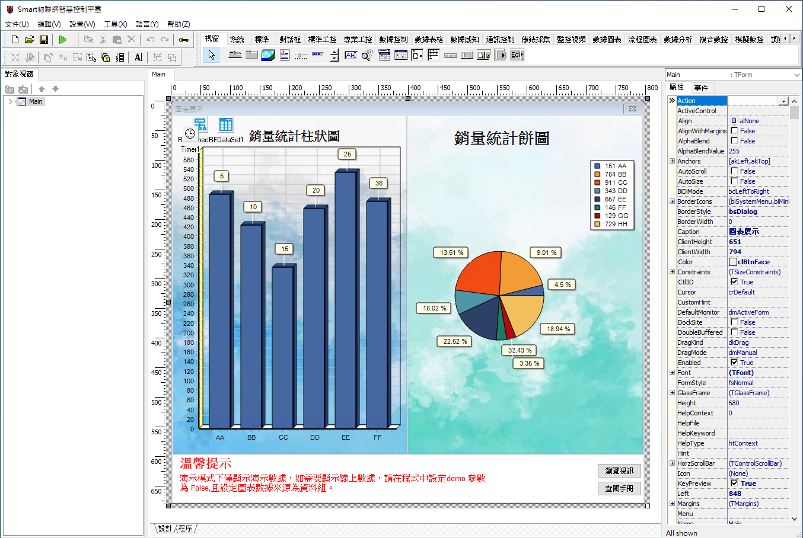
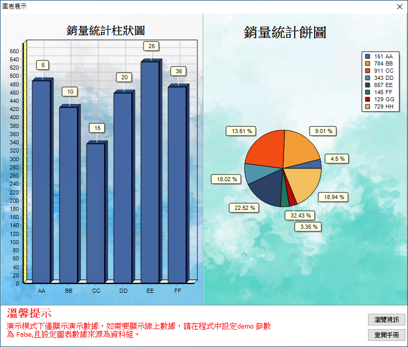

# Smart 圖表展示

Smart 智慧控制平臺，實現集中監控、資訊共用、智慧控制，與 ERP 企業經營管理系統協調互動。社區版功能無差別，全部免費。

> **請加入【FaceBook社團】掌握產品最新動態**
>
> [https://www.facebook.com/groups/535849751457439](https://www.facebook.com/groups/535849751457439)

圖表展示功能可用於顯示統計圖表，可根據需求自行選定圖表的顯示格式。該功能需配置 Smart 中的帳套設定使之能訪問 TARS。範例使用的是構造的模擬數據，無須使用特定的資料庫，任意資料庫均可使用。

圖表展示功能的數據來源於資料庫，程序將讀取到的數據儲存于數據集中。圖表控制元件根據數據集中的數據展示所需的圖表。圖表展示的型別可以是常規圖表(柱狀圖、餅圖、折線圖)，也可以是其他行業的專業圖表。

通過範例學習，可以掌握 TDBChart 的使用方式，製作圖表。

* **產品**：https://isoface.net/isoface/production/software/smart
* **範例手冊**：https://isoface.net/isoface/doc/smart/demo/chart/
* **範例視訊**：https://isoface.net/isoface/component/k2/video-tutorial/smart/s-eq-dem-2023
* **產品說明**：https://isoface.net/isoface/doc/smart/main/
* **網址**：https://isoface.net/

## 注意事項：
1. Smart 智慧控制開發工具採用 Pascal 程序語言，開發物聯網相關運用。
2. Smart 因支援多種通訊協定與視訊處理程序，在 4K 顯示器的設計模式下，字體顯示偏小，如不適應請先調整 4K 顯示器解析度在 1920 * 1080 與 2560 * 1440 之間，不便之處敬請見諒。