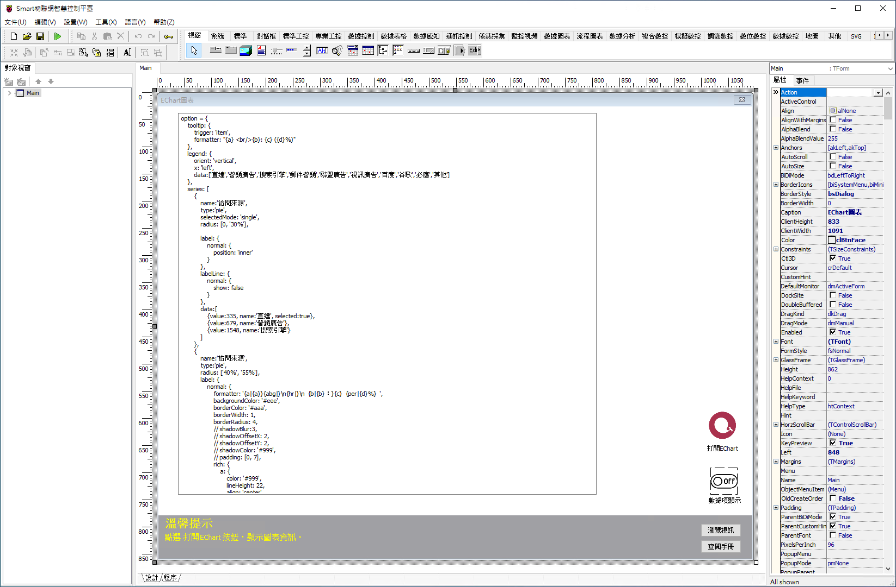
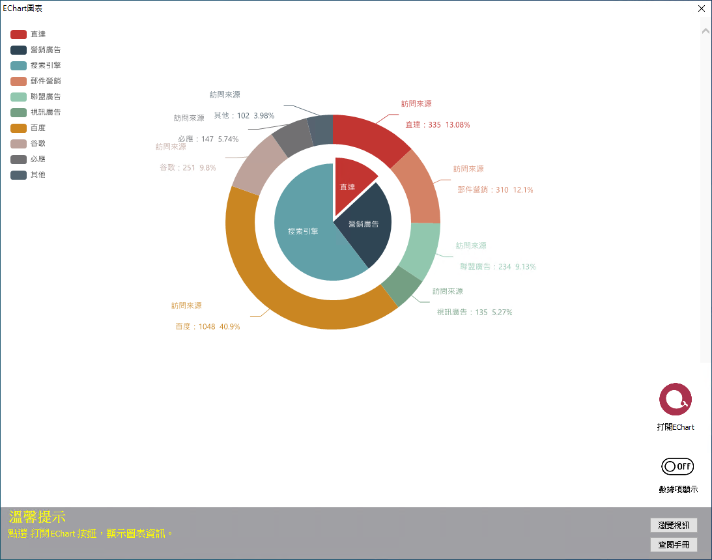

# Smart ECharts 圖表

Smart 智慧控制平臺，實現集中監控、資訊共用、智慧控制，與 ERP 企業經營管理系統協調互動。社區版功能無差別，全部免費。

> **請加入【FaceBook社團】掌握產品最新動態**
>
> [https://www.facebook.com/groups/535849751457439](https://www.facebook.com/groups/535849751457439)

範例通過 ECharts，來實現圖表數據資訊的展示。ECharts 是一個使用 JavaScript 實現的開源視覺化庫，可提供直觀，互動豐富，可高度個性化定製的數據視覺化圖表。

範例通過 ECharts，來實現圖表數據資訊的展示。ECharts 是一個使用 JavaScript 實現的開源視覺化庫，可提供直觀，互動豐富，可高度個性化定製的數據視覺化圖表。它涵蓋了各行業使用的專業圖表，滿足各行業的圖表顯示需求。

ECharts 能夠在 PC 端和移動裝置上流暢執行，相容目前絕大部分瀏覽器（IE6/7/8/9/10/11，chrome，firefox，Safari等），底層依賴輕量級的 Canvas 庫 ZRender，ECharts 提供直觀，生動，可互動，可高度個性化定製的數據視覺化圖表。創新的拖拽重計算、數據檢視、值域漫遊等特性大大增強了使用者體驗，賦予了使用者對數據進行挖掘、整合的能力。

## ECharts 有哪些特點

* ECharts 屬於開源軟體，提供了非常炫酷的圖形界面，特色是地圖，另外還提供了柱狀圖、折線圖、餅圖、氣泡圖及四象限圖等；

* ECharts 使用簡單，在官網中為我們封裝了 JS，只要會引用就會得到完美的展示效果；

* ECharts 種類多，ECharts 實現簡單，各類圖形都有；相應的模板，還有豐富的 API 及文件說明，非常詳細；

* ECharts 相容性好，基於HTML5，有著良好的動畫渲染效果。

範例通過瀏覽器呼叫 ECharts，根據文字輸入的數據，渲染出所需的圖表型別，圖表可在 Smart 的瀏覽器中顯示。

通過範例學習，可以學習在 Smart 中引入 ECharts 進行圖表展示。

* **Smart 簡介**：https://isoface.net/isoface/production/software/smart/smart
* **Smart 下載**：[點選此處下載](https://github.com/isoface-iot/Smart/releases/latest)
* **Smart 使用手冊**：https://isoface.net/isoface/doc/smart/main/
* **範例手冊**：https://isoface.net/isoface/doc/smart/demo/echarts/
* **範例視訊**：https://isoface.net/isoface/component/k2/video-tutorial/smart/s-eq-dem-2025
* **Smart 快速上手**：https://isoface.net/isoface/study/quick-start/2022-05-28-03-08-29/smart
* **無需安裝，Smart線上試用**：https://isoface.net/isoface/support/trial/smart

## 注意事項：
1. Smart 智慧控制開發工具採用 Pascal 程序語言，開發物聯網相關運用。
2. Smart 因支援多種通訊協定與視訊處理程序，在 4K 顯示器的設計模式下，字體顯示偏小，如不適應請先調整 4K 顯示器解析度在 1920 * 1080 與 2560 * 1440 之間，不便之處敬請見諒。