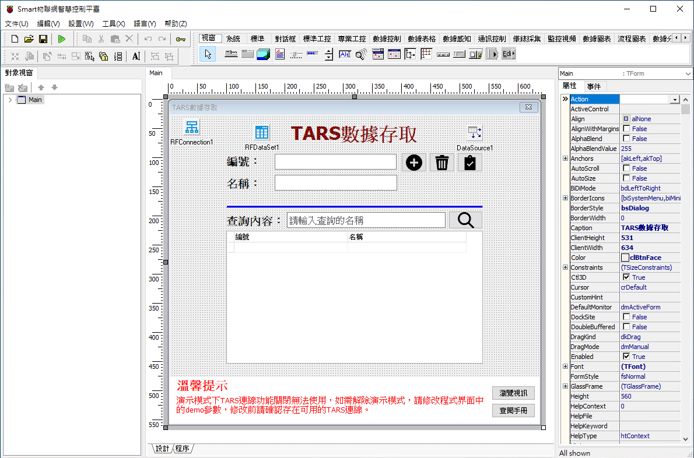
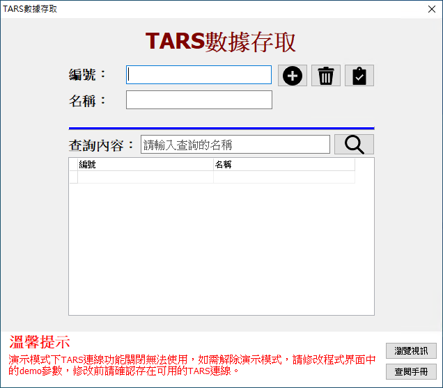

# Smart TARS 數據存取

Smart 智慧控制平臺，實現集中監控、資訊共用、智慧控制，與 ERP 企業經營管理系統協調互動。社區版功能無差別，全部免費。

> **請加入【FaceBook社團】掌握產品最新動態**
>
> [https://www.facebook.com/groups/535849751457439](https://www.facebook.com/groups/535849751457439)

範例通過連線 TARS 實現對資料庫的增刪改查操作。Smart 上可以實現對資料庫的簡單查詢，可以實現採集數據的記錄。

TARS是裝置與資料庫伺服器，主要功能包括：資料庫存取、物聯網監控、檔案傳輸、訊息傳輸，支援多種資料庫(MSSQL、MySQL、Oracle..)，與跨平臺連線服務。採用多種工業通訊協定(MQTT、RESTful、Modbus、OPC)，連線創客開發板，整合各型別電機、機械裝置。

TARS簡單、高效、穩定、安全，提供全天候、長時間穩定的執行。TARS是愛招飛系列產品的核心，以企業資源管理與工業數據為根基，提供豐富的工業數據獲取、分析、建模以及企業與工廠管理應用開發的能力。

通過範例學習，可以掌握 Smart 通過連線 TARS 實現對資料庫的增刪改查操作的方式。

* **產品**：https://isoface.net/isoface/production/software/smart
* **範例手冊**：https://isoface.net/isoface/doc/smart/demo/tars-io/
* **範例視訊**：https://isoface.net/isoface/component/k2/video-tutorial/smart/s-eq-dem-2026
* **產品說明**：https://isoface.net/isoface/doc/smart/main/
* **網址**：https://isoface.net/

## 注意事項：
1. Smart 智慧控制開發工具採用 Pascal 程序語言，開發物聯網相關運用。
2. Smart 因支援多種通訊協定與視訊處理程序，在 4K 顯示器的設計模式下，字體顯示偏小，如不適應請先調整 4K 顯示器解析度在 1920 * 1080 與 2560 * 1440 之間，不便之處敬請見諒。