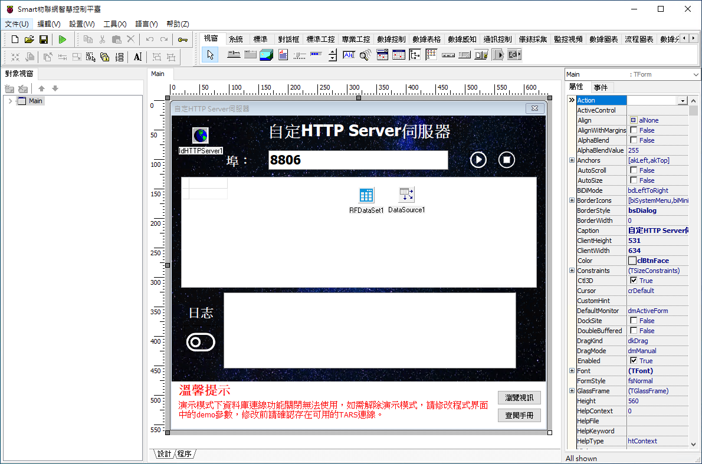
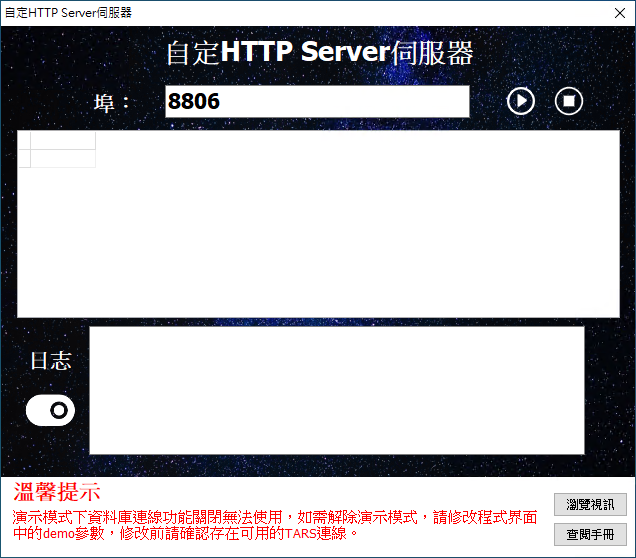
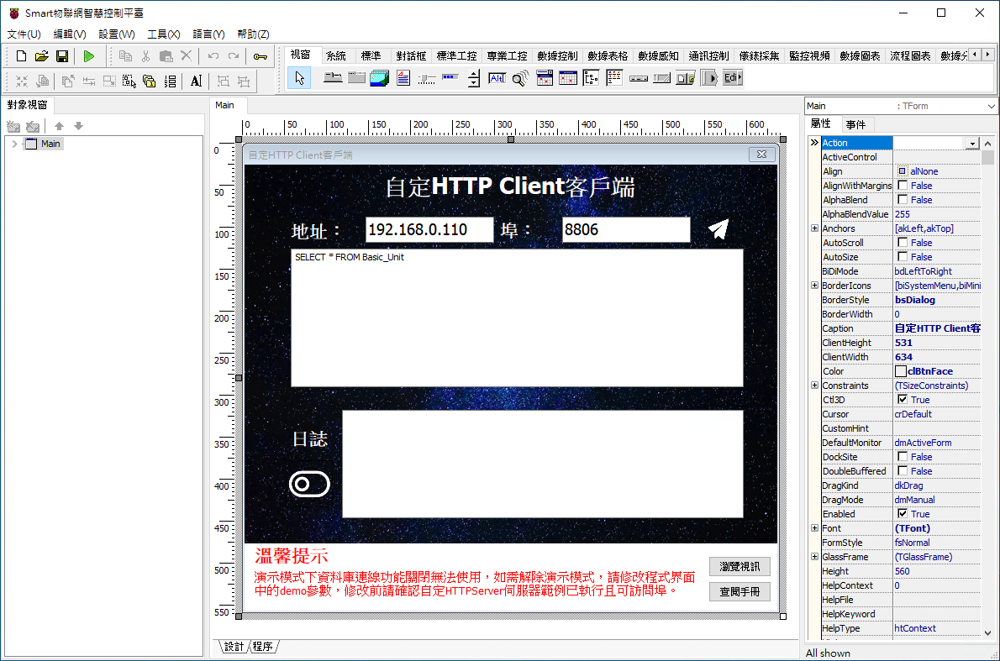
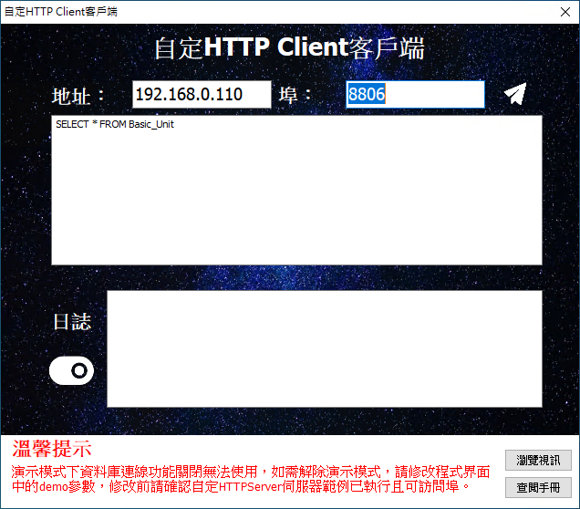

# Smart 自定 HTTP 服務

Smart 智慧控制平臺，實現集中監控、資訊共用、智慧控制，與 ERP 企業經營管理系統協調互動。社區版功能無差別，全部免費。

> **加入 Facebook 社團**
>
> [https://www.facebook.com/groups/isoface/](https://www.facebook.com/groups/isoface/)
> 
> **點讚追蹤 Facebook 粉絲專頁**
> 
> [https://www.facebook.com/AIOT.ERP](https://www.facebook.com/AIOT.ERP)

採用 HTTP 協議，建立數據伺服器，通過訪問對應的 API 進行數據操作。

範例使用的是類 rest 風格的請求方式，rest api 是前後端分離最佳實踐，是開發的一套標準或者說是一套規範。其優點如下：

1. 輕量，直接通過http，不需要額外的協議，通常有 `post/get/put/delete` 操作。
2. 面向資源，一目瞭然，具有自解釋性。
3. 數據描述簡單，一般通過 json 或者 xml 做數據通訊。

範例提供一個 RestAPI 服務端與客戶端， 客戶端向服務端發送請求，服務端根據發送的請求向資料庫伺服器發送查詢請求，講獲取的數據資訊以 JSON 格式返回。

* **Smart 簡介**：https://isoface.net/isoface/production/software/smart/smart
* **Smart 下載**：[點選此處下載](https://github.com/isoface-iot/Smart/releases/latest)
* **Smart 使用手冊**：https://isoface.net/isoface/doc/smart/main/
* **範例手冊**：https://isoface.net/isoface/doc/smart/demo/http-server/
* **範例視訊**：https://isoface.net/isoface/component/k2/video-tutorial/smart/s-eq-dem-2029
* **Smart 快速上手**：https://isoface.net/isoface/study/quick-start/2022-05-28-03-08-29/smart
* **無需安裝，Smart線上試用**：https://isoface.net/isoface/support/trial/smart
## 注意事項：
1. Smart 智慧控制開發工具採用 Pascal 程序語言，開發物聯網相關運用。
2. Smart 因支援多種通訊協定與視訊處理程序，在 4K 顯示器的設計模式下，字體顯示偏小，如不適應請先調整 4K 顯示器解析度在 1920 * 1080 與 2560 * 1440 之間，不便之處敬請見諒。

