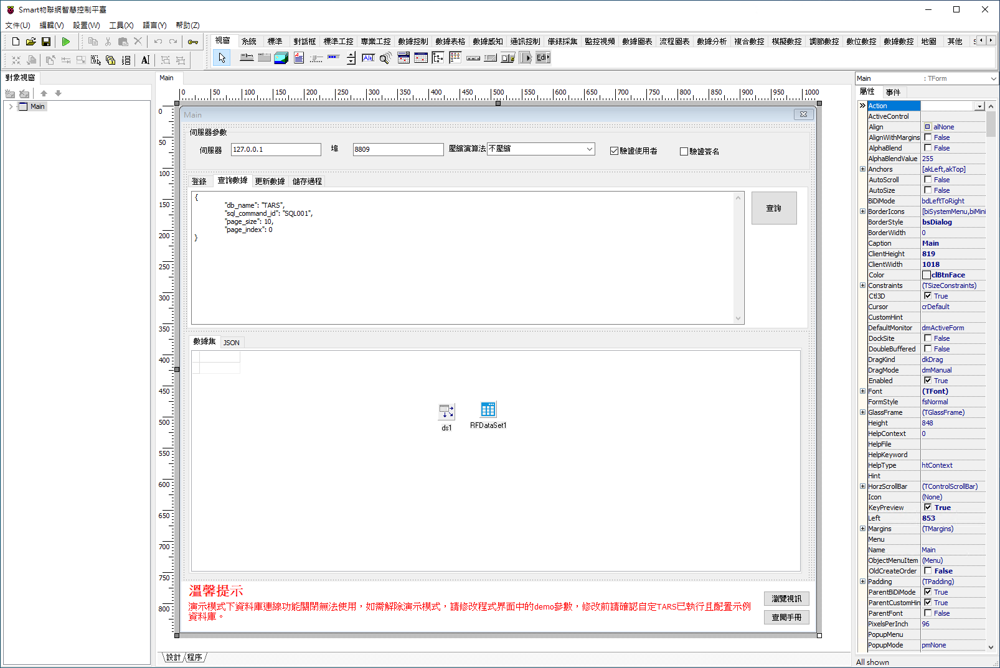

# Smart TARS RestAPI 應用

Smart 智慧控制平臺，實現集中監控、資訊共用、智慧控制，與 ERP 企業經營管理系統協調互動。社區版僅供個人且非商業使用。

> **加入 Facebook 社團**
>
> [https://www.facebook.com/groups/isoface/](https://www.facebook.com/groups/isoface/)
> 
> **點讚追蹤 Facebook 粉絲專頁**
> 
> [https://www.facebook.com/AIOT.ERP](https://www.facebook.com/AIOT.ERP)

TARS 中包含了 RestAPI 功能，可以通過 HTTPURL 的形式去訪問來實現 TARS 的各個功能。

TARS 中的 RestAPI 包含了資料庫連線讀寫的基礎功能，可通過 RestAPI 來發送相關指令，實現資料庫的讀寫功能。通過 RestAPI，TARS 可實現第三方管理系統的對接。

範例搭建了一個基礎的 RestAPI 請求的客戶端，您可根據這個範例瞭解 Smart 中引用 TARS RestAPI 的方法。

通過範例學習，可以掌握 TARS 中 RestAPI 的使用方法，並結合 Smart 實現訪問的相關功能。

* **Smart 簡介**：https://isoface.net/isoface/production/software/smart/smart
* **Smart 下載**：[點選此處下載](https://github.com/isoface-iot/Smart/releases/latest)
* **Smart 使用手冊**：https://isoface.net/isoface/doc/smart/main/
* **範例手冊**：https://isoface.net/isoface/doc/smart/demo/restapi-tars/
* **範例視訊**：https://isoface.net/isoface/component/k2/video-tutorial/smart/s-eq-dem-2045
* **Smart 快速上手**：https://isoface.net/isoface/study/quick-start/2022-05-28-03-08-29/smart
* **無需安裝，Smart線上試用**：https://isoface.net/isoface/support/trial/smart

## 注意事項：
1. Smart 智慧控制開發工具採用 Pascal 程序語言，開發物聯網相關運用。
2. Smart 因支援多種通訊協定與視訊處理程序，在 4K 顯示器的設計模式下，字體顯示偏小，如不適應請先調整 4K 顯示器解析度在 1920 * 1080 與 2560 * 1440 之間，不便之處敬請見諒。