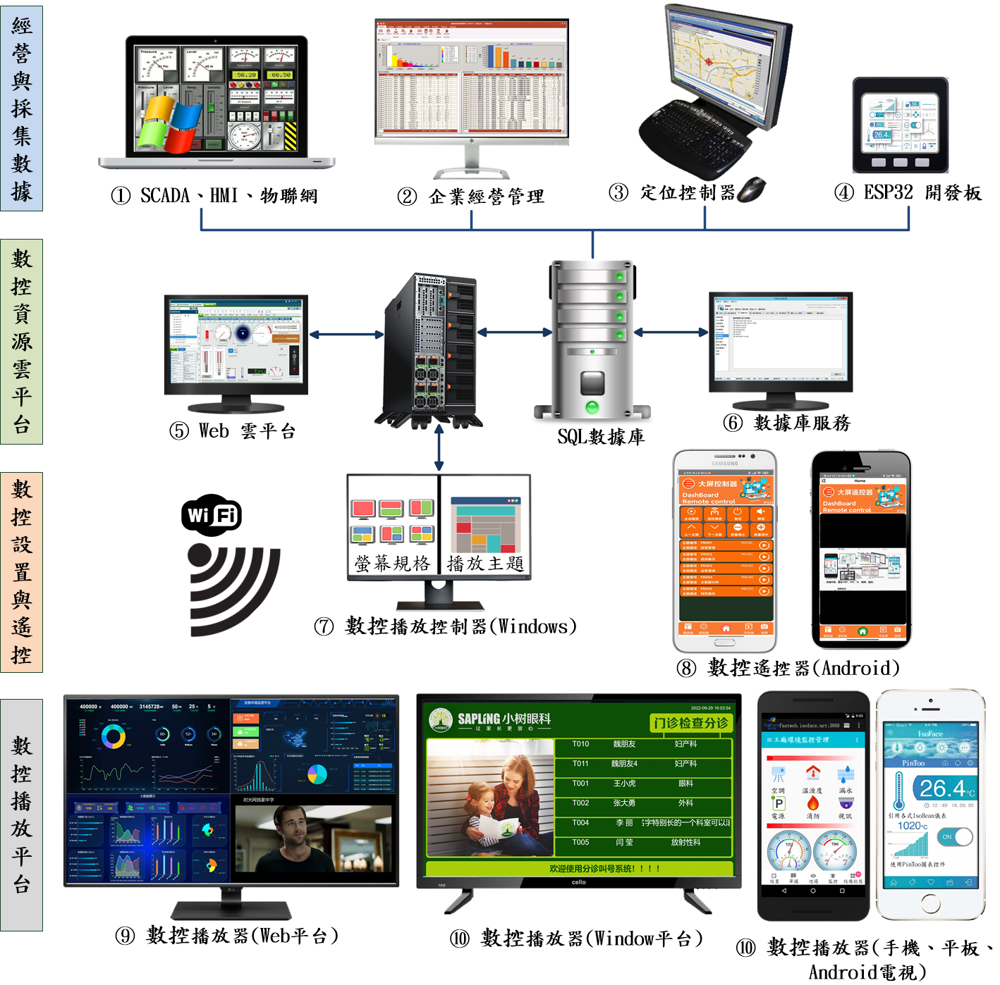

# 战情指挥系统

Smart 智慧控制平臺，實現集中監控、資訊共用、智慧控制，與 ERP 企業經營管理系統協調互動。社區版僅供個人且非商業使用。
> **加入 Facebook 社團**
>
> [https://www.facebook.com/groups/isoface/](https://www.facebook.com/groups/isoface/)
> 
> **點讚追蹤 Facebook 粉絲專頁**
> 
> [https://www.facebook.com/AIOT.ERP](https://www.facebook.com/AIOT.ERP)

數控中心-戰情指揮系統是愛招飛針對數據大屏展示的播放器集群控制推出的解決方案，數控中心-戰情指揮系統可隨時動態調整每個播放器上顯示的內容，可顯示的內容包括數據大屏，視訊監控，人員定位，企業經營管理等。有了數控中心-戰情指揮系統，不再侷限於已有的大屏報表模板，您可以自己定製所需的大屏。

戰情指揮系統，整合企業各種管理數據，透過即時看板管理，呈現人、機、物的動態訊息，透過視覺化管理，建立監控機制，讓企業管理數據有跡可循。但是縱然有精闢的戰情數據，如果無法及時又快速的呈現在管理者眼前，往往失去經營先機。

戰情指揮系統，經由固定的條件設定。任意指定播放場域，無論是生產現場、會議室、遠端視訊會議，均能應對自如。戰情顯示可以分割不同子畫面，同時展現關聯內容，不放過任何資訊。以往想控制大屏上的顯示內容，都使用紅外線遙控器，現在人們普遍「機不離手」，戰情指揮系統使用手機控制大屏。只需在手機下載大屏遙控器應用程式，就可以連線播放器，控制大屏，開始遙控。而且手機的遙控介面比傳統的遙控器簡潔。

數控中心-戰情指揮系統有幾個基本的概念，特在此進行說明。

* **播放器**：播放、顯示內容的終端，這些終端設備上安裝有數控中心-戰情指揮系統的播放器程式。
* **主題**：播放顯示內容的樣式佈局，每個主題都有不同的樣式設計。
* **戰情**：播放顯示的內容，戰情可以是數據大屏展示或是視訊監控、企業經營管理等內容。

關於上述概念，下面一張圖可幫助理解。

關於數控中心的更多說明，請參閱以下內容：

* 數控中心-戰情指揮系統型錄：https://isoface.net/isoface/production/dcc/bigscreen
* 數控中心-戰情指揮系統說明：https://isoface.net/isoface/prodoc/dcc/bigscreen/main/

## 注意事項：
1. Smart智能控制開發工具採用 Pascal 程式語言，開發物聯網相關運用。
2. Smart 因支援多種通訊協議與視訊處理程式，在 4K顯示器的設計模式下，字型顯示偏小，如不適應請先調整 4K 顯示器解析度在 1920 * 1080 與 2560 * 1440 之間，不便之處敬請見諒。