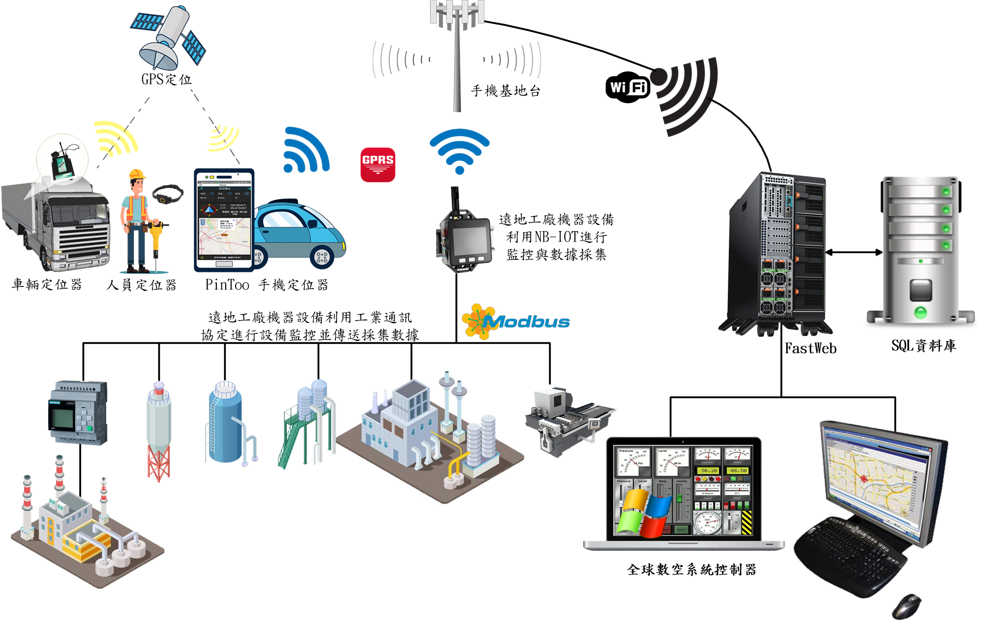

# 人車定位系統

Smart 智慧控制平臺，實現集中監控、資訊共用、智慧控制，與 ERP 企業經營管理系統協調互動。社區版僅供個人且非商業使用。

> **加入 Facebook 社團**
>
> [https://www.facebook.com/groups/isoface/](https://www.facebook.com/groups/isoface/)
> 
> **點讚追蹤 Facebook 粉絲專頁**
> 
> [https://www.facebook.com/AIOT.ERP](https://www.facebook.com/AIOT.ERP)

利用 GPS 定位系統與開放的 OpenStreetMap，自製企業地圖。掌控企業因公外出之人、車、物..最新地理位址與動態，與客戶、廠商的相對關係。同時呈現在企業地圖中一覽無遺。全球數控系統超越硬體與網路傳輸限制，提供使用者智慧影像擷取服務，使用工業通訊協定，將遠地機器設備、資產、進行地圖定位與即時監控、採集數據。所有定位與採集監控數據回傳雲端平臺，精準掌握企業脈動。

數控中心-定位系統是愛招飛針對企業的人員、車輛、物件的定位需求提供的解決方案，它使用地圖作為大屏展示，相關的人、物定位資訊展示于地圖中，可在定位服務系統中查詢到追蹤對像目前所處的位置，歷史移動的軌跡，以及發送實時圖文訊息等功能。

關於數控中心的更多說明，請參閱以下內容：

* 數控中心-定位系統型錄：https://isoface.net/isoface/production/dcc/gps
* 數控中心-戰情指揮系統說明：https://isoface.net/isoface/prodoc/dcc/gps/main/

## 注意事項：
1. Smart智能控制開發工具採用 Pascal 程式語言，開發物聯網相關運用。
2. Smart 因支援多種通訊協議與視訊處理程式，在 4K顯示器的設計模式下，字型顯示偏小，如不適應請先調整 4K 顯示器解析度在 1920 * 1080 與 2560 * 1440 之間，不便之處敬請見諒。