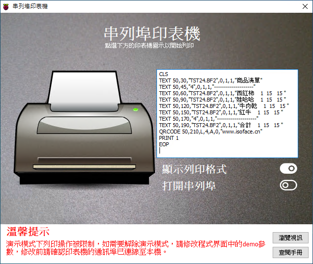

# Smart 通訊埠印表機

Smart 智慧控制平臺，實現集中監控、資訊共用、智慧控制，與 ERP 企業經營管理系統協調互動。社區版功能無差別，全部免費。

> **請加入【FaceBook社團】掌握產品最新動態**
>
> [https://www.facebook.com/groups/535849751457439](https://www.facebook.com/groups/535849751457439)

範例採用通訊埠通訊協議，控制通訊埠印表機進行列印輸出。通過向通訊埠輸入特定列印指令的字元，印表機對指令進行解析並列印出所需的內容。目前市面上的一些帶有通訊埠的標籤印表機使用的是 TSPL(TSC 標籤印表機的通訊埠列印程式語言)，通過通訊埠輸入的內容需按照 TSPL 的規範進行。

範例使用到的是佳博 GP-3120TN 標籤印表機，該印表機帶有一個通訊埠介面，可用於接收 TSPL 指令進行列印操作。

在使用前，先將 USB 通訊埠轉接線的通訊埠端與標籤印表機的通訊埠端連線，再將 USB 端與 PC 進行連線。印表機通電並打開印表機的電源開關，待 PC 端確認裝置連線后，在 Windows 的裝置管理器中檢視連線的通訊埠埠號，該埠號會在接下來的範例中使用到。

通過範例學習，可以掌握 TComport 元件的基本屬性，以及通過通訊埠進行列印操作的方法。

* **產品**：https://isoface.net/isoface/production/software/smart
* **範例手冊**：https://isoface.net/isoface/doc/smart/demo/com-printer/
* **範例視訊**：https://isoface.net/isoface/component/k2/video-tutorial/smart/s-eq-dem-2001
* **產品說明**：https://isoface.net/isoface/doc/smart/main/
* **網址**：https://isoface.net/

## 注意事項：
1. Smart 智慧控制開發工具採用 Pascal 程序語言，開發物聯網相關運用。
2. Smart 因支援多種通訊協定與視訊處理程序，在 4K顯示器的設計模式下，字體顯示偏小，如不適應請先調整 4K 顯示器解析度在 1920 * 1080 與 2560 * 1440 之間，不便之處敬請見諒。