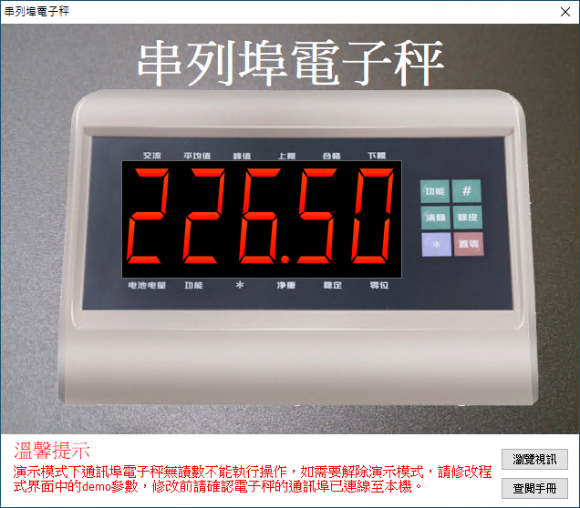

# Smart 通訊埠電子秤

Smart 智慧控制平臺，實現集中監控、資訊共用、智慧控制，與 ERP 企業經營管理系統協調互動。社區版功能無差別，全部免費。

> **加入 Facebook 社團**
>
> [https://www.facebook.com/groups/isoface/](https://www.facebook.com/groups/isoface/)
> 
> **點讚追蹤 Facebook 粉絲專頁**
> 
> [https://www.facebook.com/AIOT.ERP](https://www.facebook.com/AIOT.ERP)

範例採用通訊埠通訊協議，控制駁接在 PC 裝置上的電子秤。PC 端發送讀取指令，電子秤返回稱重重量的資訊；PC 端發送去皮與置零的指令，電子秤端執行相應的操作。電子秤是工業生產過程中經常使用到的裝置，現如今大部分近期生產的工業用電子秤都已經預留了通訊埠通訊的介面。在本範例中使用的電子秤也具有該功能。

範例使用到的電子秤為耀華 XK3190-A12+E。電子秤的外接通訊埠端與 USB 通訊埠轉接線的通訊埠端相連，另外一端與 PC 的 USB 埠連線，打開電子秤的開關，待連線確認后，打開 Windows 中的裝置管理器，檢視該通訊埠埠號，在本範例中會使用到此埠號。

通過範例學習，可以掌握通訊埠的基本通訊原理，並結合電子秤進行數據讀取的功能。

* **Smart 簡介**：https://isoface.net/isoface/production/software/smart/smart
* **Smart 下載**：[點選此處下載](https://github.com/isoface-iot/Smart/releases/latest)
* **Smart 使用手冊**：https://isoface.net/isoface/doc/smart/main/
* **範例手冊**：https://isoface.net/isoface/doc/smart/demo/com-scale/
* **範例視訊**：https://isoface.net/isoface/component/k2/video-tutorial/smart/s-eq-dem-2002
* **Smart 快速上手**：https://isoface.net/isoface/study/quick-start/2022-05-28-03-08-29/smart
* **無需安裝，Smart線上試用**：https://isoface.net/isoface/support/trial/smart

## 注意事項：
1. Smart 智慧控制開發工具採用 Pascal 程序語言，開發物聯網相關運用。
2. Smart 因支援多種通訊協定與視訊處理程序，在 4K 顯示器的設計模式下，字體顯示偏小，如不適應請先調整 4K 顯示器解析度在 1920 * 1080 與 2560 * 1440 之間，不便之處敬請見諒。