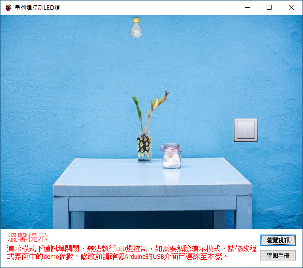

# Smart 通訊埠控制 LED 燈

Smart 智慧控制平臺，實現集中監控、資訊共用、智慧控制，與 ERP 企業經營管理系統協調互動。社區版功能無差別，全部免費。

> **加入 Facebook 社團**
>
> [https://www.facebook.com/groups/isoface/](https://www.facebook.com/groups/isoface/)
> 
> **點讚追蹤 Facebook 粉絲專頁**
> 
> [https://www.facebook.com/diylogi](https://www.facebook.com/diylogi)

使用Smart智慧控制平臺，通過通訊埠控制連線到 Arduino 的 LED。當從通訊埠輸出高電平時，開啟 Arduino 開發板上的 LED ，當通訊埠輸出低位電平時，關閉 Arduino 開發板上的 LED。

LED 發光二極管是電子電路中常用的元器件，它便宜且耐用，通常用於訊號指示的電路中。在範例中，我們使用一個 LED 發光二極管，它的正極（二極管腳較長的一端）與一個電阻相連，LED 發光二極管的負極（二極管腳較短的一端）與 Arduino 開發板的地線 (GND) 相連。此處使用到一個限流電阻，因為 Arduino 開發板輸出的電流為 5V，超出二極管的工作電壓，接入電阻后可以降低二極管的電壓，避免二極管被擊穿。

電阻與 Arduino 的針腳 8 相連，因此針腳 8 為訊號輸出端，我們在程式中也對該針腳進行了定義。當針腳 8 輸出高位電平時，LED 發光二極管點亮；針腳 8 輸出低位電平時，LED 發光二極管熄滅。

通過範例學習，可以掌握通訊埠元件的基本屬性，並結合 Arduino 開發板，通過通訊埠控制 LED 燈的功能。

* **Smart 簡介**：https://isoface.net/isoface/production/software/smart/smart
* **Smart 下載**：[點選此處下載](https://github.com/isoface-iot/Smart/releases/latest)
* **Smart 使用手冊**：https://isoface.net/isoface/doc/smart/main/
* **範例手冊**：https://isoface.net/isoface/doc/smart/demo/com-led/
* **範例視訊**：https://isoface.net/isoface/component/k2/video-tutorial/smart/s-eq-dem-2004
* **Smart 快速上手**：https://isoface.net/isoface/study/quick-start/2022-05-28-03-08-29/smart
* **無需安裝，Smart線上試用**：https://isoface.net/isoface/support/trial/smart

## 注意事項：
1. Smart 智慧控制開發工具採用 Pascal 程序語言，開發物聯網相關運用。
2. Smart 因支援多種通訊協定與視訊處理程序，在 4K 顯示器的設計模式下，字體顯示偏小，如不適應請先調整 4K 顯示器解析度在 1920 * 1080 與 2560 * 1440 之間，不便之處敬請見諒。