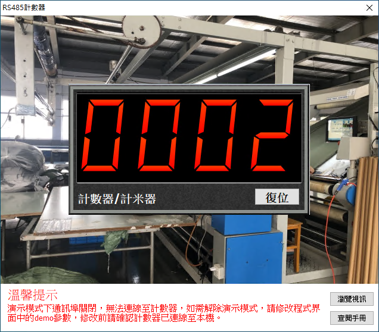

# Smart RS485 計數器

Smart 智慧控制平臺，實現集中監控、資訊共用、智慧控制，與 ERP 企業經營管理系統協調互動。社區版功能無差別，全部免費。

> **加入 Facebook 社團**
>
> [https://www.facebook.com/groups/isoface/](https://www.facebook.com/groups/isoface/)
> 
> **點讚追蹤 Facebook 粉絲專頁**
> 
> [https://www.facebook.com/AIOT.ERP](https://www.facebook.com/AIOT.ERP)

範例採用 RS485 介面，通過 ModbusRTU 通訊協議，讀取計數器數據並控制數據顯示。使用 Modbus 協議進行計數器數值的讀取，並且寫入數值 0 以達到清零的效果。

範例使用到的計數器為 FC304N-R 計數器，該計數器通過 RS485 協議與計算機進行連線通訊。配合該計數器使用到的配件包含 USB-485 轉換器，金屬接近開關感測器，電源線纜，通訊線纜。計數器的 220V 介面與 220V 電源連線，12V+，12V- 與 IN1 分別與金屬接近開關的正極、負極、訊號極相連。計數器的 485A、485B 介面分別與 USB-485 的正極，負極相連。USB-485 轉換器在連線至計算機時會被識別為通訊埠，請記住通訊埠的埠號，在接下來的配置過程中會使用到此埠號。

通過範例學習，可以掌握 ModbusRTU 的基本通訊原理，並通過 RS485 進行計數器的讀取與控制功能。

* **Smart 簡介**：https://isoface.net/isoface/production/software/smart/smart
* **Smart 下載**：[點選此處下載](https://github.com/isoface-iot/Smart/releases/latest)
* **Smart 使用手冊**：https://isoface.net/isoface/doc/smart/main/
* **範例手冊**：https://isoface.net/isoface/doc/smart/demo/rs485-counter/
* **範例視訊**：https://isoface.net/isoface/component/k2/video-tutorial/smart/s-eq-dem-2005
* **Smart 快速上手**：https://isoface.net/isoface/study/quick-start/2022-05-28-03-08-29/smart
* **無需安裝，Smart線上試用**：https://isoface.net/isoface/support/trial/smart

## 注意事項：
1. Smart 智慧控制開發工具採用 Pascal 程序語言，開發物聯網相關運用。
2. Smart 因支援多種通訊協定與視訊處理程序，在 4K 顯示器的設計模式下，字體顯示偏小，如不適應請先調整 4K 顯示器解析度在 1920 * 1080 與 2560 * 1440 之間，不便之處敬請見諒。