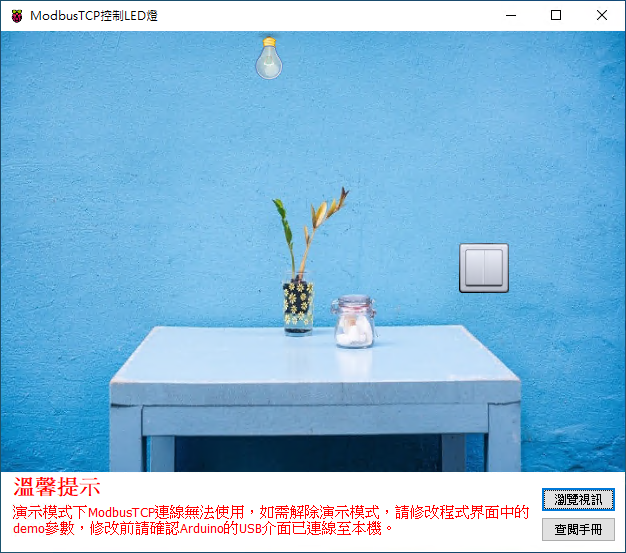

# Smart ModbusTCP 控制 LED 燈

Smart 智慧控制平臺，實現集中監控、資訊共用、智慧控制，與 ERP 企業經營管理系統協調互動。社區版功能無差別，全部免費。

> **加入 Facebook 社團**
>
> [https://www.facebook.com/groups/isoface/](https://www.facebook.com/groups/isoface/)
> 
> **點讚追蹤 Facebook 粉絲專頁**
> 
> [https://www.facebook.com/AIOT.ERP](https://www.facebook.com/AIOT.ERP)

採用 ModbusTCP 通訊協議，控制駁接在 Arduino 上的 LED 燈。ModbusTCP 使用電腦來指定特定 IP 地址下的 ModbusTCP 從機，從而控制該從機。範例中使用 Arduino 開發板與 Ethernet  W5100 網路擴充套件板，組合稱 ModbusTCP 從機。其工作方式如下：

PC 裝置 (ModbusTCP 主機) 通過 ModbusTCP 通訊協議傳送指令給指定的 IP 地址，該地址下對應一個 ModbusTCP 從機，要求打開連線該從機的 LED 燈，從機收到主機指令後會自動解碼，接著完成 ModbusTCP 主機所指派的工作，開啟 LED 燈。

範例中 LED 燈正極(針腳較長的一端)連線到電阻，再連線到 Ethernet W5100 的 D8 針腳，LED 燈的負極連線到擴充套件板的 GND 針腳。

通過範例學習，可以掌握 ModbusTCPWriteChannel、ModbusTCPReadChannel 元件基本屬性配置，向 Modbus 裝置寫入數據的使用，並結合 Arduino 開發板進行 LED 燈的控制功能。

* **Smart 簡介**：https://isoface.net/isoface/production/software/smart/smart
* **Smart 下載**：[點選此處下載](https://github.com/isoface-iot/Smart/releases/latest)
* **Smart 使用手冊**：https://isoface.net/isoface/doc/smart/main/
* **範例手冊**：https://isoface.net/isoface/doc/smart/demo/modbustcp-led/
* **範例視訊**：https://isoface.net/isoface/component/k2/video-tutorial/smart/s-eq-dem-2007
* **Smart 快速上手**：https://isoface.net/isoface/study/quick-start/2022-05-28-03-08-29/smart
* **無需安裝，Smart線上試用**：https://isoface.net/isoface/support/trial/smart

## 注意事項：
1. Smart 智慧控制開發工具採用 Pascal 程序語言，開發物聯網相關運用。
2. Smart 因支援多種通訊協定與視訊處理程序，在 4K 顯示器的設計模式下，字體顯示偏小，如不適應請先調整 4K 顯示器解析度在 1920 * 1080 與 2560 * 1440 之間，不便之處敬請見諒。