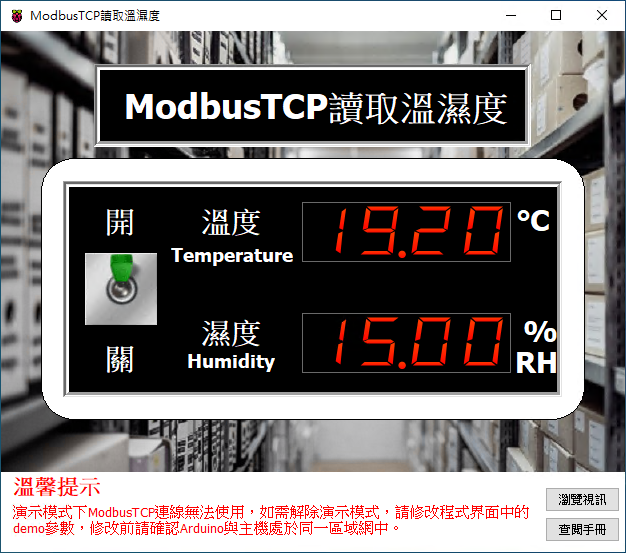

# Smart ModbusTCP 讀取溫濕度

Smart 智慧控制平臺，實現集中監控、資訊共用、智慧控制，與 ERP 企業經營管理系統協調互動。社區版僅供個人且非商業使用。

> **加入 Facebook 社團**
>
> [https://www.facebook.com/groups/isoface/](https://www.facebook.com/groups/isoface/)
> 
> **點讚追蹤 Facebook 粉絲專頁**
> 
> [https://www.facebook.com/AIOT.ERP](https://www.facebook.com/AIOT.ERP)

範例採用 ModbusTCP 通訊協議，讀取駁接在 Arduino 上的 DHT22 溫濕度感測器的數據。

DHT22 是 DHT 系列的一款應用廣泛的溫濕度感測器。在範例中，DHT22 溫濕度模組的接線方式為正極接入 W5100 開發板的 VCC(5V) 引腳，負極接入 W5100 開發板的 (GND) 引腳，訊號極 (OUT) 接入 W5100 開發板的 8 號引腳。DHT22 的特性如下表所示。

|    名稱     |    取值     |
| ----------- | ----------- |
| 工作電壓     | 3V–5.5V     |
| 溫度測量範圍 | -40℃–80℃ |
| 溫度測量精度 | 0.5℃      |
| 濕度測量範圍 | 0–100% RH   |
| 濕度測量精度 | 2% RH       |

通過範例學習，可以掌握ModbusTCP控制元件的基本設定，並結合Arduino開發板進行DHT22溫濕度感測器的數據採集。

* **Smart 簡介**：https://isoface.net/isoface/production/software/smart/smart
* **Smart 下載**：[點選此處下載](https://github.com/isoface-iot/Smart/releases/latest)
* **Smart 使用手冊**：https://isoface.net/isoface/doc/smart/main/
* **範例手冊**：https://isoface.net/isoface/doc/smart/demo/modbustcp-dht/
* **範例視訊**：https://isoface.net/isoface/component/k2/video-tutorial/smart/s-eq-dem-2008
* **Smart 快速上手**：https://isoface.net/isoface/study/quick-start/2022-05-28-03-08-29/smart
* **無需安裝，Smart線上試用**：https://isoface.net/isoface/support/trial/smart

## 注意事項：
1. Smart 智慧控制開發工具採用 Pascal 程序語言，開發物聯網相關運用。
2. Smart 因支援多種通訊協定與視訊處理程序，在 4K 顯示器的設計模式下，字體顯示偏小，如不適應請先調整 4K 顯示器解析度在 1920 * 1080 與 2560 * 1440 之間，不便之處敬請見諒。