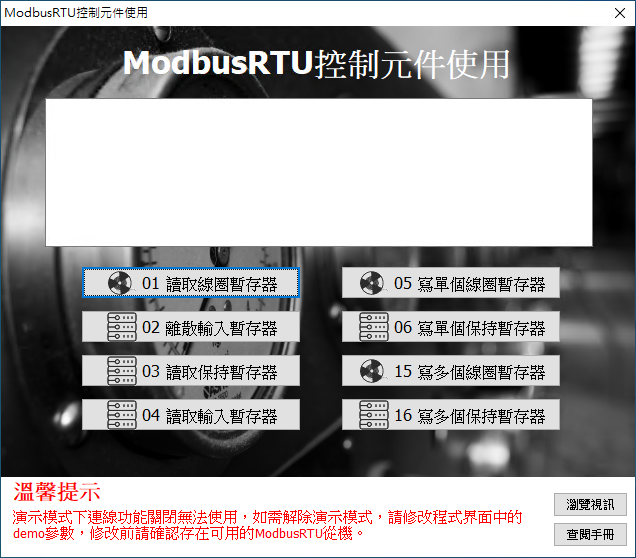

# Smart ModbusRTU 控制元件使用

Smart 智慧控制平臺，實現集中監控、資訊共用、智慧控制，與 ERP 企業經營管理系統協調互動。社區版非商業用途可免費使用。

> **加入 Facebook 社團**
>
> [https://www.facebook.com/groups/isoface/](https://www.facebook.com/groups/isoface/)
> 
> **點讚追蹤 Facebook 粉絲專頁**
> 
> [https://www.facebook.com/AIOT.ERP](https://www.facebook.com/AIOT.ERP)

範例實現 ModbusRTU 控制元件的使用。為使用 ModbusRTU 協議進行通訊的裝置除錯提供基礎。Modbus 是工業界廣泛使用的通訊協議，使用控制元件可用於控制工業裝置，採集數據資訊等功能。在使用以下功能之前，需提前在 PC 裝置上安裝 Modbus Slave 或者其他 Modbus 模擬軟體，開啟 ModbusRTU 協議，並使用虛擬通訊埠的軟體（比如 Virtual Serial Port Driver 等）建立虛擬通訊埠用於除錯。

通過範例學習，可以掌握 ModbusClient 的使用方式以及 ModbusConnection 的配置方法。

* **Smart 簡介**：https://isoface.net/isoface/production/software/smart/smart
* **Smart 下載**：[點選此處下載](https://github.com/isoface-iot/Smart/releases/latest)
* **Smart 使用手冊**：https://isoface.net/isoface/doc/smart/main/
* **範例手冊**：https://isoface.net/isoface/doc/smart/demo/modbusrtu/
* **範例視訊**：https://isoface.net/isoface/component/k2/video-tutorial/smart/s-eq-dem-2009
* **Smart 快速上手**：https://isoface.net/isoface/study/quick-start/2022-05-28-03-08-29/smart
* **無需安裝，Smart線上試用**：https://isoface.net/isoface/support/trial/smart

## 注意事項：
1. Smart 智慧控制開發工具採用 Pascal 程序語言，開發物聯網相關運用。
2. Smart 因支援多種通訊協定與視訊處理程序，在 4K 顯示器的設計模式下，字體顯示偏小，如不適應請先調整 4K 顯示器解析度在 1920 * 1080 與 2560 * 1440 之間，不便之處敬請見諒。