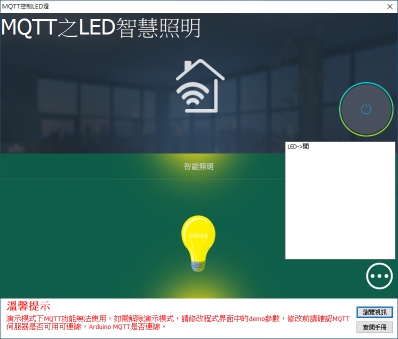

# Smart MQTT 控制 LED 燈

Smart 智慧控制平臺，實現集中監控、資訊共用、智慧控制，與 ERP 企業經營管理系統協調互動。社區版功能無差別，全部免費。

> **加入 Facebook 社團**
>
> [https://www.facebook.com/groups/isoface/](https://www.facebook.com/groups/isoface/)
> 
> **點讚追蹤 Facebook 粉絲專頁**
> 
> [https://www.facebook.com/diylogi](https://www.facebook.com/diylogi)

範例採用 MQTT 通訊協議，控制駁接在 Arduino 上的 LED 燈。MQTT 是由 IBM 開發的通訊協議，為感測器提供一個輕量可靠的二進制通訊設定，使得開發 MQTT 與物聯網，機器之間的通訊變得非常簡單。

TARS 中也提供了 MQTT 服務，使用 TARS 中的該服務可以實現裝置之間的相互連線。範例中的 LED 燈連正極(長腳)處連線電阻再連線到 Ethernet W5100 擴充套件板的 D8 針腳，LED 燈負極連線到擴充套件板的 GND 針腳，以下介紹如何利用 MQTT 通訊協議，達到控制的目的。

通過範例學習，可以掌握 MQTTClient 控制元件的基本使用，並結合 Arduino 開發板通過 MQTT 進行 LED 的控制功能。

* **Smart 簡介**：https://isoface.net/isoface/production/software/smart/smart
* **Smart 下載**：[點選此處下載](https://github.com/isoface-iot/Smart/releases/latest)
* **Smart 使用手冊**：https://isoface.net/isoface/doc/smart/main/
* **範例手冊**：https://isoface.net/isoface/doc/smart/demo/mqtt-led/
* **範例視訊**：https://isoface.net/isoface/component/k2/video-tutorial/smart/s-eq-dem-2014
* **Smart 快速上手**：https://isoface.net/isoface/study/quick-start/2022-05-28-03-08-29/smart
* **無需安裝，Smart線上試用**：https://isoface.net/isoface/support/trial/smart
## 注意事項：
1. Smart 智慧控制開發工具採用 Pascal 程序語言，開發物聯網相關運用。
2. Smart 因支援多種通訊協定與視訊處理程序，在 4K 顯示器的設計模式下，字體顯示偏小，如不適應請先調整 4K 顯示器解析度在 1920 * 1080 與 2560 * 1440 之間，不便之處敬請見諒。