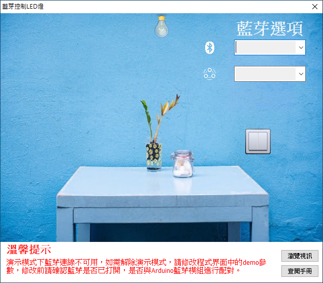

# Smart 藍芽控制 LED 燈

Smart 智慧控制平臺，實現集中監控、資訊共用、智慧控制，與 ERP 企業經營管理系統協調互動。社區版僅供個人且非商業使用。

> **加入 Facebook 社團**
>
> [https://www.facebook.com/groups/isoface/](https://www.facebook.com/groups/isoface/)
> 
> **點讚追蹤 Facebook 粉絲專頁**
> 
> [https://www.facebook.com/AIOT.ERP](https://www.facebook.com/AIOT.ERP)

範例採用藍芽通訊協議，通過 HC-06 藍芽模組控制駁接在 Arduino 上的 LED  燈。HC-06 採用 BC417143 晶片，支援藍芽 2.1+EDR 標準，HC-06 的主控端或者從端模式是在出廠前就設定好的不能更改，通常能夠買到的 HC-06 均為從端模式。

藍芽裝置 HC-06 通過杜邦線，將 VCC 介面連線至 Arduino 5V 針腳，GND 介面連線 Arduino 的 GND，藍芽 TXD 介面連線 Arduino 10 號針腳，藍芽 RXD 連線 Arduino 11 號針腳。LED 燈的正極（長腳）連線電阻再連線到 Arduino 的 8 號針腳，LED 的負極連線到 Arduino 的 GND 針腳。

在硬體連線完成後，將 Arduino 連線電源，需要先將 PC 端與 HC-06 的藍芽配對，需使用支援藍芽功能的計算機（如不支援藍芽的計算機也可以使用 USB 藍芽適配器等外接拓展裝置使之支援藍芽功能），打開藍芽選項，可搜索到 HC-06 字樣的藍芽裝置，預設的配對 PIN 碼為 1234。範例使用的 Arduino 程式使用到的藍芽裝置庫的地址：[http://drho.club/2018/06/arduino-bluetooth-mobile-phone01/](http://drho.club/2018/06/arduino-bluetooth-mobile-phone01/)，下載該庫檔案並將其新增至 Arduino 程式庫。

通過範例學習，可以掌握藍芽的基本通訊原理，並結合 Arduino 開發板進行 LED 燈的控制功能。

* **Smart 簡介**：https://isoface.net/isoface/production/software/smart/smart
* **Smart 下載**：[點選此處下載](https://github.com/isoface-iot/Smart/releases/latest)
* **Smart 使用手冊**：https://isoface.net/isoface/doc/smart/main/
* **範例手冊**：https://isoface.net/isoface/doc/smart/demo/ble-led/
* **範例視訊**：https://isoface.net/isoface/component/k2/video-tutorial/smart/s-eq-dem-2019
* **Smart 快速上手**：https://isoface.net/isoface/study/quick-start/2022-05-28-03-08-29/smart
* **無需安裝，Smart線上試用**：https://isoface.net/isoface/support/trial/smart
## 注意事項：
1. Smart 智慧控制開發工具採用 Pascal 程序語言，開發物聯網相關運用。
2. Smart 因支援多種通訊協定與視訊處理程序，在 4K 顯示器的設計模式下，字體顯示偏小，如不適應請先調整 4K 顯示器解析度在 1920 * 1080 與 2560 * 1440 之間，不便之處敬請見諒。