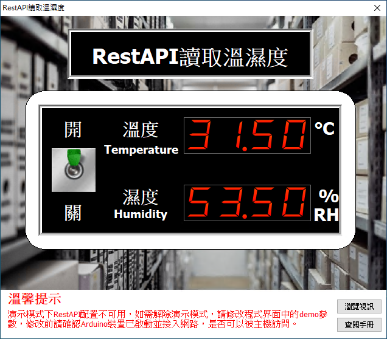

# Smart RestAPI 讀取溫濕度

Smart 智慧控制平臺，實現集中監控、資訊共用、智慧控制，與 ERP 企業經營管理系統協調互動。社區版功能無差別，全部免費。

> **請加入【FaceBook社團】掌握產品最新動態**
>
> [https://www.facebook.com/groups/535849751457439](https://www.facebook.com/groups/535849751457439)

範例採用 RestAPI 通訊，來讀取連線到 NodeMCU 的 DHT22 溫濕度感測器的數據。 NodeMCU 是以 ESP8266(ESP12) 晶片為基礎，包含了 WiFi，GPIO，PWM，ADC，I2C 等功能的主控板，執行效率高，非常適合物聯網應用開發，因為它內建了WiFi功能，與 Arduino 相容，Arduino 中可用的感測器基本都可用於 NodeMCU。範例中使用的 DHT22 感測器正極（長腳）連線接至 NodeMCU Vin 針腳，負極連線至 NodeMCU GND 針腳，訊號針腳連線至 NodeMCU D5 針腳。

範例中使用的 NodeMCU 的 ESP8266 無線網路，先從路由器獲取 IP，連線網路成功后，啟動 Rest 服務，通過訪問對應的地址獲取溫濕度數據。

通過範例學習，可以掌握 Rest 通訊的基本通訊原理，並結合 NodeMCU 開發板進行 LED 的控制功能。

* **Smart 簡介**：https://isoface.net/isoface/production/software/smart/smart
* **Smart 下載**：[點選此處下載](https://github.com/isoface-iot/Smart/releases/latest)
* **Smart 使用手冊**：https://isoface.net/isoface/doc/smart/main/
* **範例手冊**：https://isoface.net/isoface/doc/smart/demo/restapi-dht/
* **範例視訊**：https://isoface.net/isoface/component/k2/video-tutorial/smart/s-eq-dem-2044
* **Smart 快速上手**：https://isoface.net/isoface/study/quick-start/2022-05-28-03-08-29/smart
* **無需安裝，Smart線上試用**：https://isoface.net/isoface/support/trial/smart
## 注意事項：
1. Smart 智慧控制開發工具採用 Pascal 程序語言，開發物聯網相關運用。
2. Smart 因支援多種通訊協定與視訊處理程序，在 4K 顯示器的設計模式下，字體顯示偏小，如不適應請先調整 4K 顯示器解析度在 1920 * 1080 與 2560 * 1440 之間，不便之處敬請見諒。