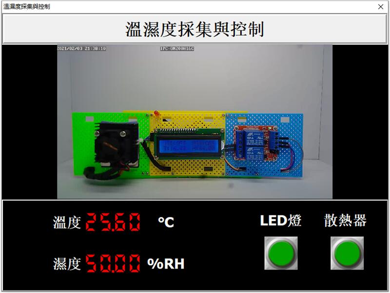

# Smart 溫濕度採集與控制

Smart 智慧控制平臺，實現集中監控、資訊共用、智慧控制，與 ERP 企業經營管理系統協調互動。社區版功能無差別，全部免費。

> **加入 Facebook 社團**
>
> [https://www.facebook.com/groups/isoface/](https://www.facebook.com/groups/isoface/)
> 
> **點讚追蹤 Facebook 粉絲專頁**
> 
> [https://www.facebook.com/diylogi](https://www.facebook.com/diylogi)

範例使用 ModbusTCP 通訊協議，讀取連線至 Arduino 的溫濕度感測器數據，同時可通過 ModbusTCP 來控制 LED 燈以及繼電器開關。可通過視訊直播流檢視正在播放的裝置執行情況。

範例除使用常規的 Arduino 硬體外，還需要使用到用於進行直播錄像的攝像機，該攝像機錄製的視訊將以視訊直播流的形式發送至指定的 RTMP 伺服器中，範例從該地址中接收視訊流播放視訊錄像。在使用該範例前需要讀者對視訊直播的流程有一定的瞭解，並使用自行搭建的流媒體伺服器或者第三方的視訊直播服務進行推流直播。自行搭建的流媒體伺服器可使用[SRS](https://github.com/ossrs/srs)。

通過範例學習，可以掌握 ModbusTCP 的基本通訊原理，實現 Arduino 裝置的綜合控制。

* **Smart 簡介**：https://isoface.net/isoface/production/software/smart/smart
* **Smart 下載**：[點選此處下載](https://github.com/isoface-iot/Smart/releases/latest)
* **Smart 使用手冊**：https://isoface.net/isoface/doc/smart/main/
* **範例手冊**：https://isoface.net/isoface/doc/smart/demo/dht-control/
* **範例視訊**：https://isoface.net/isoface/component/k2/video-tutorial/smart/s-eq-dem-2049
* **Smart 快速上手**：https://isoface.net/isoface/study/quick-start/2022-05-28-03-08-29/smart
* **無需安裝，Smart線上試用**：https://isoface.net/isoface/support/trial/smart

## 注意事項：
1. Smart 智慧控制開發工具採用 Pascal 程序語言，開發物聯網相關運用。
2. Smart 因支援多種通訊協定與視訊處理程序，在 4K 顯示器的設計模式下，字體顯示偏小，如不適應請先調整 4K 顯示器解析度在 1920 * 1080 與 2560 * 1440 之間，不便之處敬請見諒。