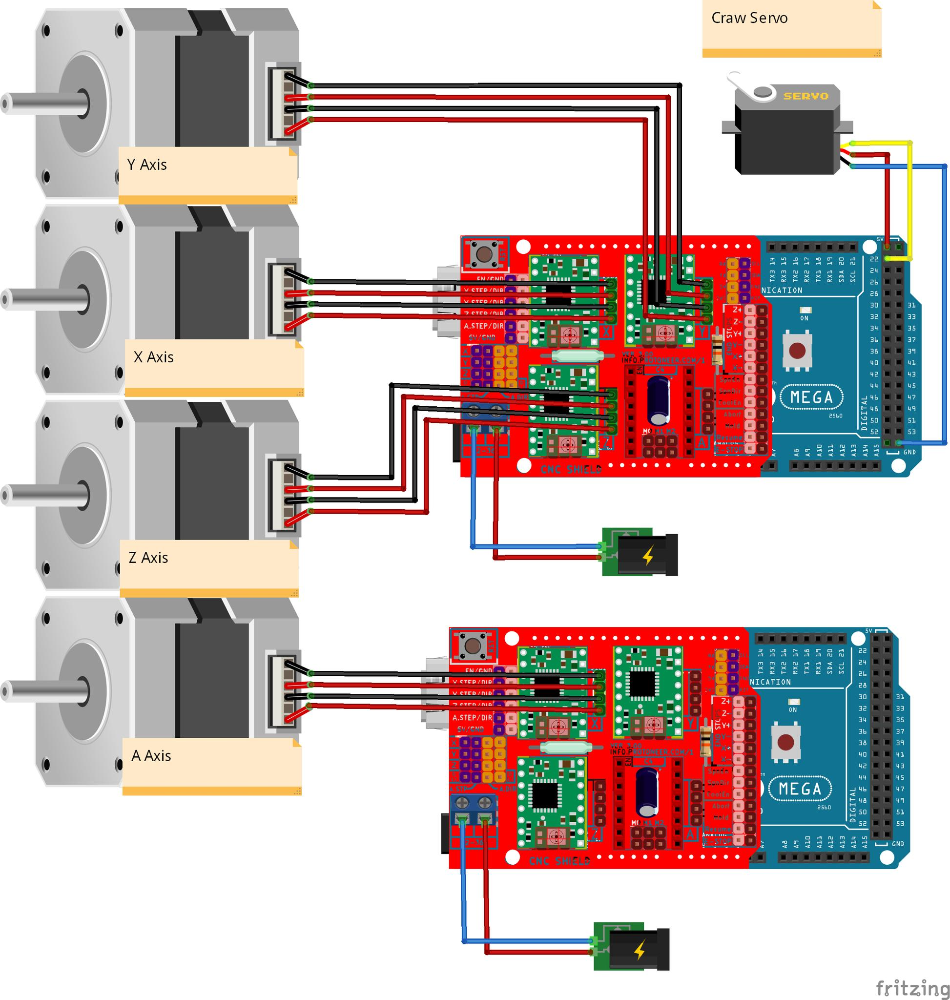
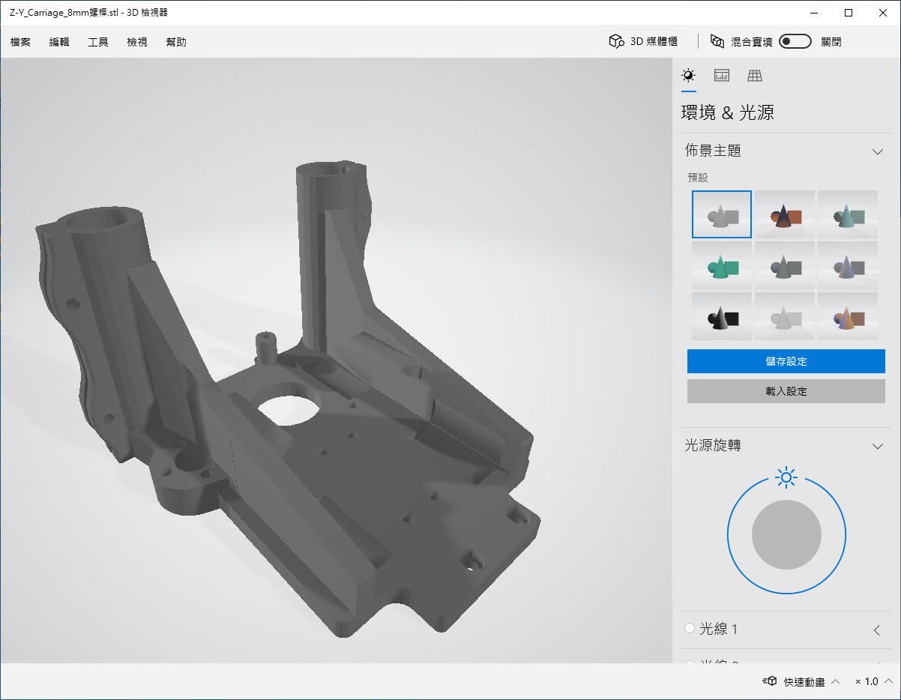
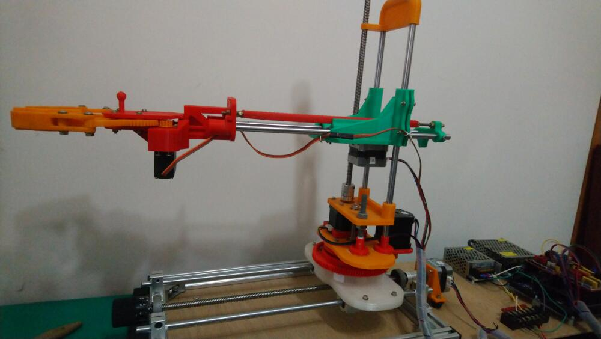
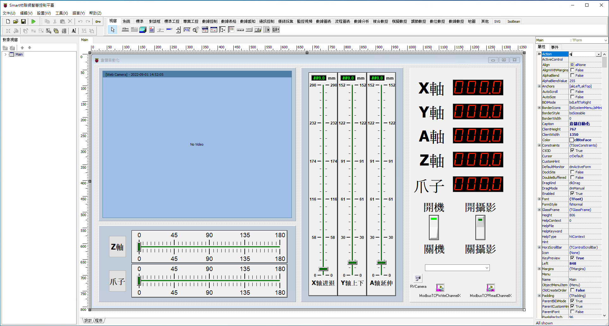
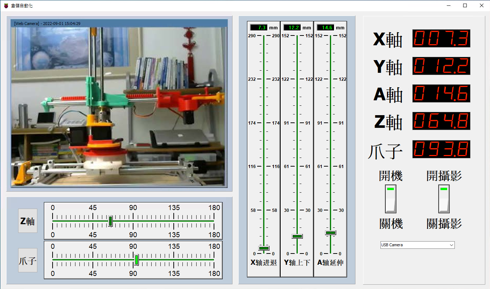

# Smart 物聯網應用軟件開發精靈，平移式機械臂

Smart 智慧控制平臺，實現集中監控、資訊共用、智慧控制，與 ERP 企業經營管理系統協調互動。社區版功能無差別，全部免費。

> **加入 Facebook 社團**
>
> [https://www.facebook.com/groups/isoface/](https://www.facebook.com/groups/isoface/)
> 
> **點讚追蹤 Facebook 粉絲專頁**
> 
> [https://www.facebook.com/diylogi](https://www.facebook.com/diylogi)

## 控制重點
1. 使用 Modbus TCP 通訊協議，利用網路發送指令給 Arduino mega2560 開發板
2. 使用開源的 Modbus TCP 程式庫，串接 Arduino mega2560、CNC Shield V3、A4988，並以此控制 42 步進馬達。
3. 連線電腦上的攝像頭，直接拍攝平移式機械臂的即時運動影像。

使用的主要零件清單：

|序號|零件名稱|數量|
|---|---|---|
|1|Arduino Mega 2560 開發板|2|
|2| 42 步進電機|4|
|3|270° 舵機|1|
|4| CNC Shield V3|2|
|5| A4988 步進電機驅動器|4|
|6| W5100 EtherNet 網路擴充套件板|2|

零件的連線示意圖如下。零件連線圖的源文件位於目錄 `Fritzing` 中，可下載並使用 Fritzing 打開。

外觀結構零件需通過3D列印獲取，可從示例中檢視工程檔案 `3D_stl` 並列印相關零件。

將列印的零件組裝成機械臂，組裝完成的機械臂如下。

程式設計界面的截圖與執行圖片顯示如下。選擇顯示視訊畫面的攝像機，在攝像機的拍攝下，拖動 Smart 界面中滑塊的位置，對應機械臂的軸根據發出的指令移動。通過動作的組合，實現機械臂的位移以及抓取物體、鬆開物體等操作。

* **Smart 簡介**：https://isoface.net/isoface/production/software/smart/smart
* **Smart 下載**：[點選此處下載](https://github.com/isoface-iot/Smart/releases/latest)
* **Smart 使用手冊**：https://isoface.net/isoface/doc/smart/main/
* **Smart 快速上手**：https://isoface.net/isoface/study/quick-start/2022-05-28-03-08-29/smart
* **無需安裝，Smart線上試用**：https://isoface.net/isoface/support/trial/smart

## 注意事項：
1. Smart 智慧控制開發工具採用 Pascal 程序語言，開發物聯網相關運用。
2. Smart 因支援多種通訊協定與視訊處理程序，在 4K 顯示器的設計模式下，字體顯示偏小，如不適應請先調整 4K 顯示器解析度在 1920 * 1080 與 2560 * 1440 之間，不便之處敬請見諒。