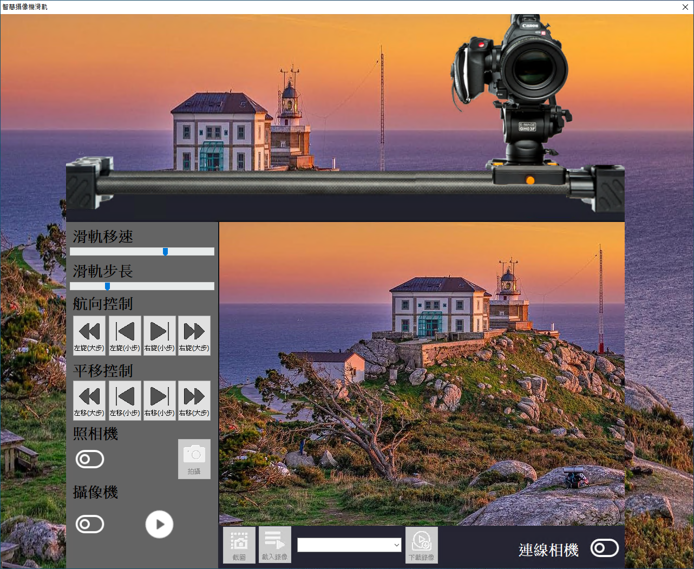

# Smart 軌道照相機

Smart 智慧控制平臺，實現集中監控、資訊共用、智慧控制，與 ERP 企業經營管理系統協調互動。社區版非商業用途可免費使用。

> **加入 Facebook 社團**
>
> [https://www.facebook.com/groups/isoface/](https://www.facebook.com/groups/isoface/)
> 
> **點讚追蹤 Facebook 粉絲專頁**
> 
> [https://www.facebook.com/AIOT.ERP](https://www.facebook.com/AIOT.ERP)

使用 手機攝像頭作為網路攝像頭使用，Smart 通過視訊伺服器接收手機攝像頭獲取的視訊流，實現視訊的錄製與截圖的功能。

同時 ESP32 通過 WebSocket 連線至 Smart，Smart 通過此協議向 ESP32 連線的滑軌發送移動的命令，從而實現滑軌的定點移動。

上述功能需配套 PinToo 的滑軌照相機伺服器使用，可檢視 PinToo 界面中的滑軌照相機示例說明。

使用的主要零件清單：

|序號|零件名稱|數量|
|---|---|---|
|1|NodeMCU ESP32S|1|
|2|28BYJ-48 步進電機(帶驅動板)|2|
|3|滑軌軌道套裝|1|
|4|杜邦線|若干|

* **Smart 簡介**：https://isoface.net/isoface/production/software/smart/smart
* **Smart 下載**：[點選此處下載](https://github.com/isoface-iot/Smart/releases/latest)
* **Smart 使用手冊**：https://isoface.net/isoface/doc/smart/main/
* **Smart 快速上手**：https://isoface.net/isoface/study/quick-start/2022-05-28-03-08-29/smart
* **無需安裝，Smart線上試用**：https://isoface.net/isoface/support/trial/smart

## 注意事項：
1. Smart 智慧控制開發工具採用 Pascal 程序語言，開發物聯網相關運用。
2. Smart 因支援多種通訊協定與視訊處理程序，在 4K 顯示器的設計模式下，字體顯示偏小，如不適應請先調整 4K 顯示器解析度在 1920 * 1080 與 2560 * 1440 之間，不便之處敬請見諒。