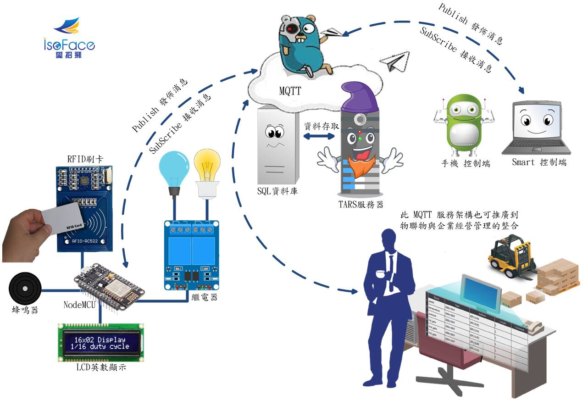
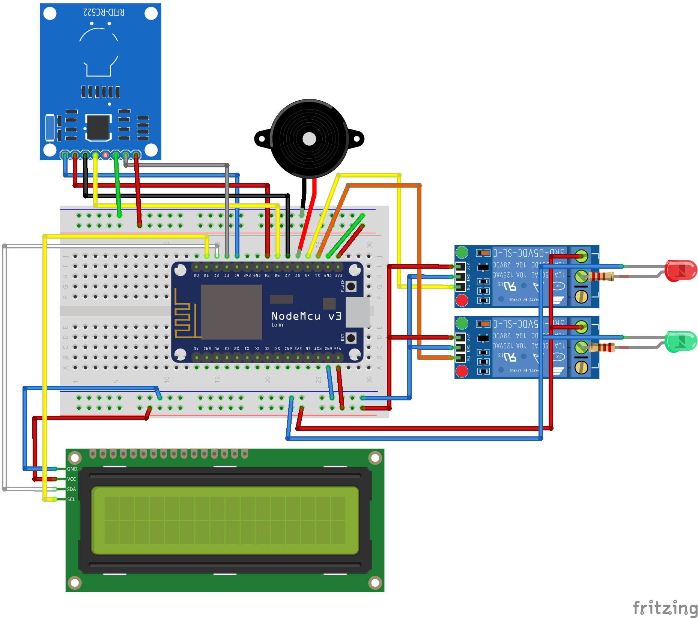
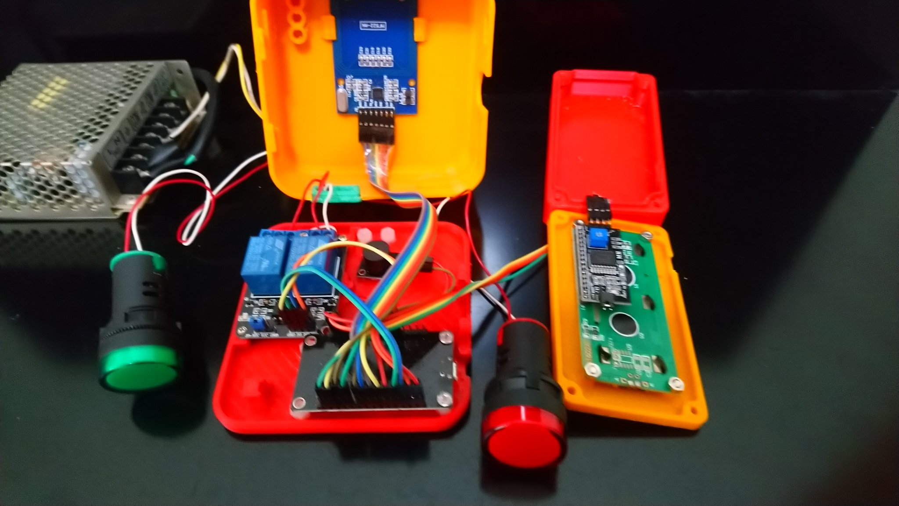
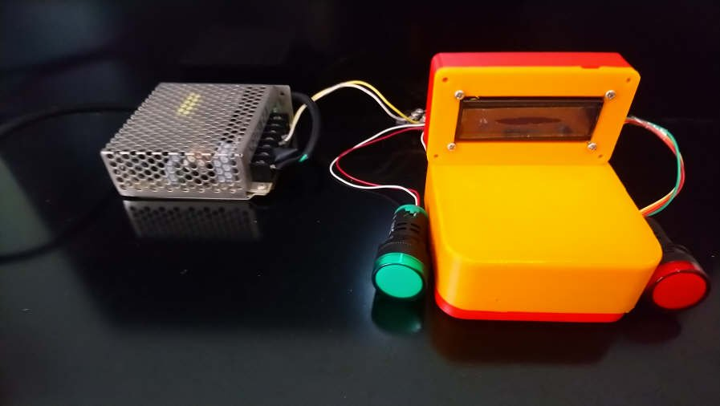
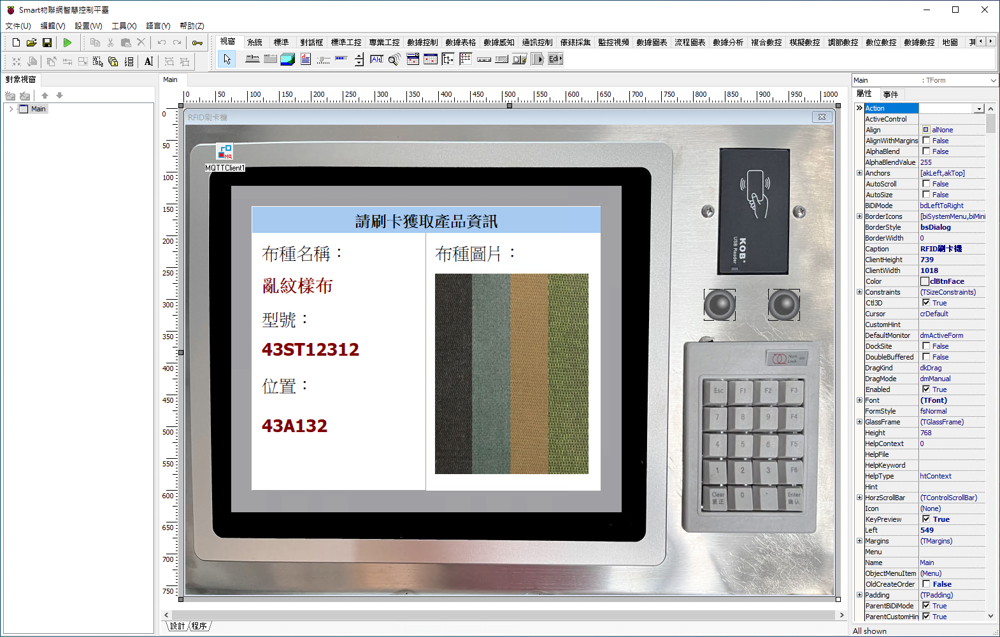
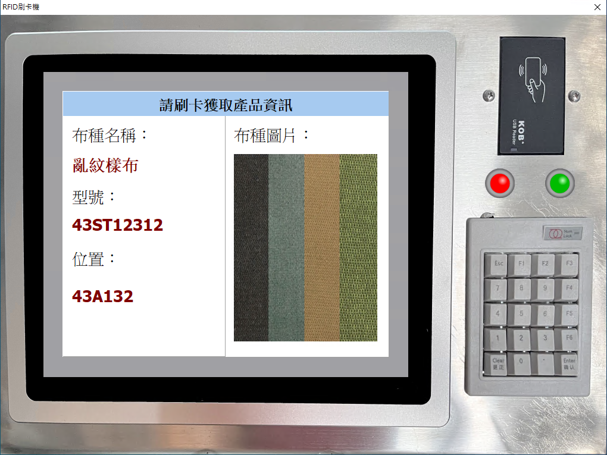

# 物聯網應用軟件開發精靈 Smart，連線自製刷卡裝置(NodeMCU、RFID、繼電器、蜂鳴器)運用 MQTT 通訊協定控制實體

Smart 智慧控制平臺，實現集中監控、資訊共用、智慧控制，與 ERP 企業經營管理系統協調互動。社區版功能無差別，全部免費。

> **加入 Facebook 社團**
>
> [https://www.facebook.com/groups/isoface/](https://www.facebook.com/groups/isoface/)
> 
> **點讚追蹤 Facebook 粉絲專頁**
> 
> [https://www.facebook.com/diylogi](https://www.facebook.com/diylogi)

## 說明

採用 ESP8266 NodeMCU 開發板，連線 RFID 刷卡裝置，當有人刷卡時觸動蜂鳴器響聲，並將卡片訊息，使用 MQTT 通訊協定 Publish 發佈訊息給 TARS 伺服器，TARS 也具備 MQTT Broker功能，緊接將訊息發佈給使用者端。

Smart 使用者端經由 TARS 伺服器，SubScribe 接收訊息，立即進行內部處理，依據卡片訊息，查詢 SQL 資料庫，將查詢結果顯示在螢幕。

使用者設定控制方法，Smart 在範例中，控制置電燈開啟與關閉，再經由 TARS 伺服器 Publish 發佈訊息，NodeMCU 開發板，使用繼電器連線電燈，控制電燈開關。經由 TARS 伺服器 SubScribe 接收訊息，該訊息為 Smart 發送。設定電燈的開關判斷處理方法。

使用的主要零件清單：

|序號|零件名稱|數量|
|---|---|---|
|1|NodeMCU ESP8266 Lua WIFI V3 開發板 |1|
|2|2 路 5V/12V 繼電器模組 高低電位觸發|1|
|3|MFRC-522 RC522 RFID IC 卡感應 附白卡|1|
|4|I2C LCD1602 液晶顯示屏|1|
|5| LED 發光二極管|紅色、綠色各 1 個，共計 2 個|
|6| 220Ω 電阻 |2|
|7|蜂鳴器模組|1|

零件連線圖如下。

加上 3D 列印的外殼后，實際組裝的圖示如下。

設計 Smart 界面，設計的頁面顯示如下。

執行界面顯示如下。執行刷卡時，如果有匹配到關鍵字資訊，則螢幕上會顯示刷卡的結果顯示資訊。

1. 外觀結構零件需通過3D列印獲取，可從示例中檢視工程檔案 `3D_stl` 並列印相關零件。
2. 刷卡裝置將 TARS 做為 MQTT 服務器，就無需使用其它 MQTT Server。TARS 還是數據庫應用服務器，連接各種 SQL 數據庫。
3. 範例的重點不在於設備架設，而是如何運用此軟體架構，在其它實務工作上。了解如何搭配 TARS 服務器，做出專業實用的應用軟體。

* **Smart 簡介**：https://isoface.net/isoface/production/software/smart/smart
* **Smart 下載**：[點選此處下載](https://github.com/isoface-iot/Smart/releases/latest)
* **Smart 使用手冊**：https://isoface.net/isoface/doc/smart/main/
* **Smart 快速上手**：https://isoface.net/isoface/study/quick-start/2022-05-28-03-08-29/smart
* **無需安裝，Smart線上試用**：https://isoface.net/isoface/support/trial/smart
## 注意事項：
1. Smart 智慧控制開發工具採用 Pascal 程序語言，開發物聯網相關運用。
2. Smart 因支援多種通訊協定與視訊處理程序，在 4K 顯示器的設計模式下，字體顯示偏小，如不適應請先調整 4K 顯示器解析度在 1920 * 1080 與 2560 * 1440 之間，不便之處敬請見諒。
