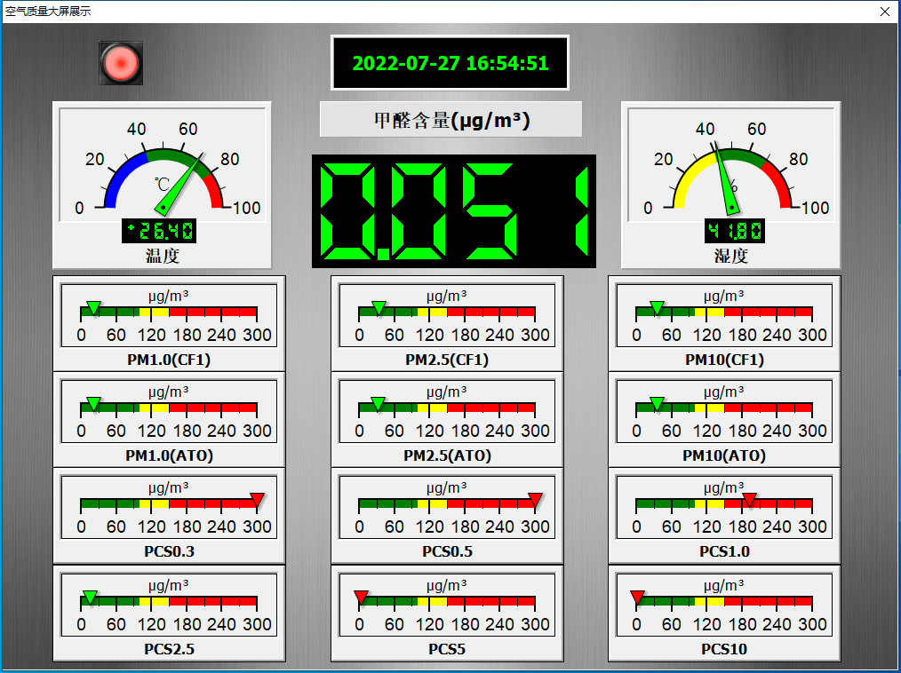

# Smart PM2.5 感測器數據讀取

Smart 智慧控制平臺，實現集中監控、資訊共用、智慧控制，與 ERP 企業經營管理系統協調互動。社區版功能無差別，全部免費。

> **加入 Facebook 社團**
>
> [https://www.facebook.com/groups/isoface/](https://www.facebook.com/groups/isoface/)
> 
> **點讚追蹤 Facebook 粉絲專頁**
> 
> [https://www.facebook.com/AIOT.ERP](https://www.facebook.com/AIOT.ERP)

通過 ModbusTCP 協議，連線至 ESP32 串接的 PMS5003ST PM2.5 感測器，讀取感測器的數據，並存入 ESP32 的 Modbus 裝置中 ，Smart 通過裝置的連線獲取感測器的數據資訊，從而實現 PM2.5 數據的讀取。

PMS5003ST 是一款可以同時監測空氣中顆粒物濃度、甲醛濃度及溫濕度的三合一感測器。其中顆粒物濃度的監測基於鐳射散射原理，可連續採集並計算單位體積內空氣中不同粒徑的懸浮顆粒物個數，即顆粒物濃度分佈，進而換算成為質量濃度。甲醛濃度的監測基於電化學原理，具有高精度、高穩定性的特點。感測器同時內嵌瑞士生產的溫濕度一體檢測晶片。顆粒物濃度數值、甲醛濃度數值及溫度、濕度合併以通用數字介面形式輸出。本感測器可嵌入各種與空氣質量監測和改善相關的儀器裝置，為其提供及時準確的環境參數。

* **Smart 簡介**：https://isoface.net/isoface/production/software/smart/smart
* **Smart 下載**：[點選此處下載](https://github.com/isoface-iot/Smart/releases/latest)
* **Smart 使用手冊**：https://isoface.net/isoface/doc/smart/main/
* **Smart 快速上手**：https://isoface.net/isoface/study/quick-start/2022-05-28-03-08-29/smart
* **無需安裝，Smart線上試用**：https://isoface.net/isoface/support/trial/smart

## 注意事項：
1. Smart 智慧控制開發工具採用 Pascal 程序語言，開發物聯網相關運用。
2. Smart 因支援多種通訊協定與視訊處理程序，在 4K 顯示器的設計模式下，字體顯示偏小，如不適應請先調整 4K 顯示器解析度在 1920 * 1080 與 2560 * 1440 之間，不便之處敬請見諒。
