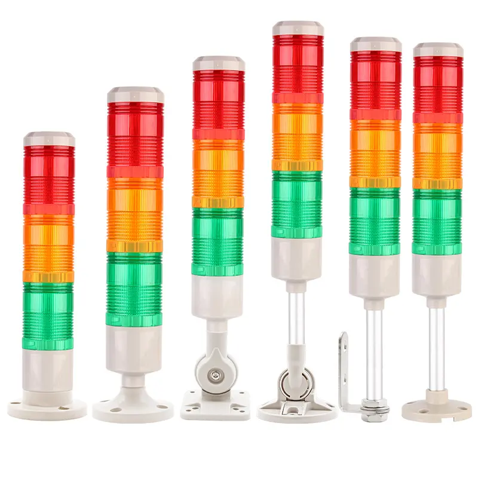

# Smart 三色声光报警器控制

Smart 智慧控制平臺，實現集中監控、資訊共用、智慧控制，與 ERP 企業經營管理系統協調互動。社區版非商業用途可免費使用。

> **加入 Facebook 社團**
>
> [https://www.facebook.com/groups/isoface/](https://www.facebook.com/groups/isoface/)
> 
> **點讚追蹤 Facebook 粉絲專頁**
> 
> [https://www.facebook.com/AIOT.ERP](https://www.facebook.com/AIOT.ERP)

Smart 通過 RestAPI 讀取 TARS 物聯網模組中連線的裝置的資訊並顯示在頁面中，使用 RestAPI 實現對三色聲光報警器的控制等相關功能。

聲光報警器，是一種用在危險場所，通過聲音和各種光來向人們發出警示訊號的一種報警裝置，可用於鋼鐵冶金、電信鐵塔、起重機械、工程機械、港口碼頭、交通運輸、風力發電、遠洋船舶等行業； 是工業報警系統中的一個配件產品。聲光報警器根據可發光的顏色型別，可分為單色聲光報警器與多色聲光報警器。而多色聲光報警器中以三色聲光報警器居多。三色聲光報警器可發出紅、綠、黃三種顏色，可用於機臺裝置狀態的指示。同時也可發出閃光和聲音，可用作警報提示。



在工廠生產過程中，通常會關注裝置的大致執行情況，比如裝置是否處於執行狀態，裝置是否出現故障，裝置是否在空轉。使用三色聲光報警器可解決上述需求，通過LED燈指示與聲音報警，現場工作人員可以及時瞭解裝置所處的執行狀態，對裝置故障及時處理。

目前範例選用帶有數據通信功能的三色聲光報警器作為被採集的對象。三色聲光報警器使用 RS485 通訊埠通訊，使用 ModbusRTU 通訊協議實現狀態讀取與控制。三色聲光報警器採用直流供電的方式，在 12V-36V 之間均可以進行工作。

示例中的聲光報警器 Modbus 暫存器採用保持暫存器，通過讀取寫入特定地址實現控制功能。


|    功能     |  地址位   |                                       取值說明                                       |
| ---------- | -------- | ----------------------------------------------------------------------------------- |
| 裝置是否線上 | 63(0x3F)  | 低位的取值為 `08` 時表示裝置線上，即取得的數字進行取餘數操作 `x mod 256 = 8` 表達式成立時裝置線上 |
| 播放狀態     | 66(0x42)  | `1025` 正在播放、`1024` 停止播放 `1026` 暫停播放                                          |
| 音量        | 67(0x43)  | 低位地址的數值表示音量等級 `01-1E` 即 0-30                                                |
| 音訊檔案數量 | 73(0x49)  | 返回的數據表示存放的檔案數量                                                            |
| 目前播放曲目 | 77(0x4D)  | 曲目的序號                                                                                    |
| 聲光狀態     | 112(0x70) | 高位 - 目前播放的曲目 低位 - 聲光狀態                                                    |

數值與聲光狀態對照表


|   數值    | 對應燈狀態 |               數值               | 對應燈狀態 |
| -------- | --------- | ------------------------------- | --------- |
| 17(0x11) | 紅燈常亮   | 35(0x23)                        | 綠燈慢閃   |
| 18(0x12) | 黃燈常亮   | 49(0x31)                        | 紅燈爆閃   |
| 19(0x13) | 綠燈常亮   | 50(0x32)                        | 黃燈爆閃   |
| 33(0x21) | 紅燈慢閃   | 51(0x33)                        | 綠燈爆閃   |
| 34(0x22) | 黃燈慢閃   | 96(0x10/0x20/0x30/0x60/0x06…)等 | 燈熄滅     |


在上述採集到的數據中，聲光狀態是重要數據，通過對聲光狀態的數據解析可以瞭解聲光報警器的亮燈狀態。

方案採用 TARS 進行數據採集，在物聯網界面中設定採集的裝置的通訊埠連線資訊、讀取的位置等資訊。將讀取到的數據通過解析後轉存至指定的資料庫中，等待數據分析。在這個過程中，TARS會將採集到的數據進行解析，獲取聲光狀態，並進行轉存操作。

儲存數據的表結構如下，請在 `demo` 資料庫中建立執行：

```sql
---裝置資訊表，用於更新裝置目前的狀態
CREATE TABLE [dbo].[oee_device](
	[id] [varchar](36) NOT NULL,
	[moduleno] [varchar](50) NULL,
	[modulename] [varchar](50) NULL,
	[moduledesc] [varchar](50) NULL,
	[sid] [int] NULL,
	[commid] [varchar](36) NULL,
	[enabled] [bit] NULL,
	[online] [bit] NULL,
	[light] [varchar](10) NULL,
	[flash] [varchar](10) NULL,
	[sound] [int] NULL,
	[soundstate] [varchar](10) NULL,
	[volume] [int] NULL,
	[updatetime] [datetime] NULL,
 CONSTRAINT [PK_oee_device] PRIMARY KEY CLUSTERED 
(
	[id] ASC
)WITH (PAD_INDEX = OFF, STATISTICS_NORECOMPUTE = OFF, IGNORE_DUP_KEY = OFF, ALLOW_ROW_LOCKS = ON, ALLOW_PAGE_LOCKS = ON) ON [PRIMARY]
) ON [PRIMARY]
GO
---裝置數據採集表，用於更新裝置資訊
CREATE TABLE [dbo].[oee_devicedata](
	[id] [varchar](36) NOT NULL,
	[moduleid] [varchar](36) NULL,
	[moduleno] [varchar](50) NULL,
	[modulename] [varchar](50) NULL,
	[site] [varchar](100) NULL,
	[time] [datetime] NULL,
	[value] [varchar](200) NULL,
	[online] [bit] NULL,
	[light] [varchar](10) NULL,
	[flash] [varchar](10) NULL,
	[sound] [int] NULL,
	[soundstate] [varchar](10) NULL,
	[volume] [int] NULL,
	[lastvalue] [varchar](200) NULL,
	[lastlight] [varchar](10) NULL,
	[lastflash] [varchar](10) NULL,
	[lastsound] [int] NULL,
	[lastsoundstate] [varchar](10) NULL,
	[lastvolume] [int] NULL,
 CONSTRAINT [PK_oee_devicedata] PRIMARY KEY CLUSTERED 
(
	[id] ASC
)WITH (PAD_INDEX = OFF, STATISTICS_NORECOMPUTE = OFF, IGNORE_DUP_KEY = OFF, ALLOW_ROW_LOCKS = ON, ALLOW_PAGE_LOCKS = ON) ON [PRIMARY]
) ON [PRIMARY]
```

在 TARS 物聯網設定項中，在 `裝置監控設定` 專案中建立兩個 Modbus 裝置監控項。可參考 [TARS-物聯網](https://isoface.net/isoface/doc/tars/function/#裝置監控設定) 進行操作。

| 裝置編號 | 裝置名稱 |
| -------- | -------- |
| 015      | light001 |
| 016      | light002 |

每個裝置分別設定如下站點：

|        站點名稱        |  數據型別   |            功能程式碼            | 數據地址 | 數據長度 | 監控週期 | 儲存頻率 |  實時傳值  | 站點型別 |
| --------------------- | ---------- | ----------------------------- | -------- | -------- | -------- | -------- | --------- | -------- |
| rsoundstate	        | Integer	 | 03ReadHoldingRegister(4x)	 | 66       | 	1      | 	30    | 	30   | 	true	 | read     |
| rvolume	            | Integer    | 	03ReadHoldingRegister(4x)    | 	67      | 	1	   | 30       | 	30   | 	true	 | read     |
| rdevicestate	        | Integer    | 	03ReadHoldingRegister(4x)    | 	63      | 	1      | 	30    | 	30   | 	true     | read     |
| rtotalfiles           | 	Integer	 | 03ReadHoldingRegister(4x)     | 	73      | 	1      | 	30    | 	30   | 	true     | 	read   |
| rsoundnum	            | Integer	 | 03ReadHoldingRegister(4x)     | 	77      | 	1      | 	30    | 	30   | 	true     | 	read   |
| rledstate             | 	Integer  | 	03ReadHoldingRegister(4x)    | 	112	    | 1	       | 30       | 	30   | 	true	 | read     |
| wsound	            | Integer    | 	06PresetSingleRegister(4x)   | 	15      | 	1      | 	5     | 	30   | 	true	 | write    |
| wnextplay	            | Integer    | 	06PresetSingleRegister(4x)   | 	1       | 	1      | 	5     | 	30   | 	true     | 	write  |
| wledstate             | 	Integer	 | 06PresetSingleRegister(4x)    | 	194	    | 1	       | 5        | 	30   | true      | 	write   |
| wpreviousplay         | 	Integer	 | 06PresetSingleRegister(4x)    | 	2	    | 1        | 	5     | 	30   | 	true     | 	write  |
| wplayindex	        | Integer    | 	06PresetSingleRegister(4x)   | 	3       | 	1      | 	5	  | 30       | 	true     | 	write  |
| wvolumeplus           | 	Integer  | 	06PresetSingleRegister(4x)   | 	4       | 	1      | 	5	  | 30       | 	true     | 	write  |
| wvolumeminus	        | Integer    | 	06PresetSingleRegister(4x)   | 	5       | 	1      | 	5     | 	30   | 	true     | 	write   |
| wvolume	            | Integer    | 	06PresetSingleRegister(4x)   | 	6	    | 1        | 	5     | 	30   | 	true     | 	write  |
| wplayrepeat	        | Integer    | 	06PresetSingleRegister(4x)   | 	8       | 	1      | 	5     | 	30   | 	true	 | write    |
| wplaydevice           | 	Integer	 | 06PresetSingleRegister(4x)    | 	9       | 	1      | 	5     | 	30   | 	true     | 	write  |
| wbaudrate	            | Integer	 | 06PresetSingleRegister(4x)    | 	11	    | 1        | 	5     | 	30   | 	true     | 	write  |
| wchipreset            | 	Integer	 | 06PresetSingleRegister(4x)    | 	12	    | 1        | 	5     | 	30   | true      | 	write   |
| wplay                 | 	Integer  | 	06PresetSingleRegister(4x)   | 	13      | 	1      | 	5	  | 30       | 	true     | 	write  |
| wpause                | 	Integer  | 	06PresetSingleRegister(4x)   | 	14      | 	1      | 	5     | 	30   | 	true     | 	write  |
| wfolderfileplayrepeat | 	Integer  | 	06PresetSingleRegister(4x)   | 	16      | 	1      | 	5     | 	30   | 	true     | 	write  |
| wplayrepeatall        | 	Integer	 | 06PresetSingleRegister(4x)	 | 17       | 	1      | 	5     | 	30   | 	true     | 	write  |
| wstopplay	            | Integer    | 	06PresetSingleRegister(4x)   | 	22      | 	1      | 	5     | 	30   | 	true     | 	write  |
| wfolderplayrepeat     | 	Integer  | 	06PresetSingleRegister(4x)   | 	23	    | 1        | 	5     | 	30   | 	true     | 	write  |
| wplayrandom           | 	Integer  | 	06PresetSingleRegister(4x)   | 	24	    | 1        | 	5     | 	30   | 	true     | 	write  |
| wnowplayrepeat	    | Integer    | 	06PresetSingleRegister(4x)	 | 25       | 	1      | 	5	  | 30       | 	true     | 	write  |
| wsid                  | 	Integer  | 	06PresetSingleRegister(4x)   | 	192	    | 1        | 	5     | 	30   | 	true     | 	write  |

其中 `rvolume` 設定的數據指令碼如下：

```pascal
begin
  This.DataValue := This.DataValue mod 256;
end.
```

`rvolume` 設定的數據轉存指令碼如下：

```sql
declare @volume int,
		@lastvolume int
SELECT @volume = :DataValue,@lastvolume = :LastValue

INSERT INTO oee_devicedata
(id, moduleid, moduleno, modulename, site, 
  time, value, online, light, flash, 
  sound, volume, lastvalue, lastlight, 
  lastflash, lastsound, lastvolume)
VALUES (NEWID(), :ModuleID, :ModuleNo, :ModuleName, :Site, 
  GETDATE(), :DataValue, NULL, NULL, NULL, 
  NULL, @volume, :LastValue, NULL, NULL, 
  NULL, @lastvolume)

IF exists(SELECT 1 FROM oee_device WHERE ModuleNo = :ModuleNo)
	UPDATE oee_device set volume = @volume, updatetime = GETDATE() WHERE ModuleNo = :ModuleNo
ELSE
  INSERT INTO oee_device(id,moduleno,modulename,volume,updatetime)
  VALUES(NEWID(),:ModuleNo,:ModuleName,@volume,GETDATE())
```

`rdevicestate` 設定的數據指令碼如下：

```pascal
begin
  This.DataValue := This.DataValue mod 256;
end.
```

`rdevicestate` 設定的數據指令碼如下：

```sql
declare @online bit
SELECT @online = CASE :DataValue WHEN 8 THEN 1 ELSE 0 END

INSERT INTO oee_devicedata
(id, moduleid, moduleno, modulename, site, 
  time, value, online, light, flash, 
  sound, volume, lastvalue, lastlight, 
  lastflash, lastsound, lastvolume)
VALUES (NEWID(), :ModuleID, :ModuleNo, :ModuleName, :Site, 
  GETDATE(), :DataValue, @online, NULL, NULL, 
  NULL, NULL, :LastValue, NULL, NULL, 
  NULL, NULL)

IF exists(SELECT 1 FROM oee_device WHERE ModuleNo = :ModuleNo)
	UPDATE oee_device set [online] = @online, updatetime = GETDATE() WHERE ModuleNo = :ModuleNo
ELSE
  INSERT INTO oee_device(id,moduleno,modulename,[online],updatetime)
  VALUES(NEWID(),:ModuleNo,:ModuleName,@online,GETDATE())
```

&emsp;&emsp;`rsoundstate` 設定的數據指令碼如下：

```sql
declare @soundstate varchar(10),
		@lastsoundstate varchar(10)

SELECT @soundstate = CASE :DataValue WHEN 1025 THEN 'play' 
WHEN 1024 THEN 'stop' WHEN 1026 THEN 'pause' END,
@lastsoundstate = CASE :DataValue WHEN 1025 THEN 'play' 
WHEN 1024 THEN 'stop' WHEN 1026 THEN 'pause' END

INSERT INTO oee_devicedata
(id, moduleid, moduleno, modulename, site, 
  time, value, online, light, flash, 
  sound, soundstate, volume, lastvalue, lastlight, 
  lastflash, lastsound, lastsoundstate, lastvolume)
VALUES (NEWID(), :ModuleID, :ModuleNo, :ModuleName, :Site, 
  GETDATE(), :DataValue, NULL, NULL, NULL, 
  NULL, @soundstate, NULL, :LastValue, NULL, NULL, 
  NULL, @lastsoundstate, NULL)

IF exists(SELECT 1 FROM oee_device WHERE ModuleNo = :ModuleNo)
  UPDATE oee_device set soundstate = @soundstate, updatetime = GETDATE() WHERE ModuleNo = :ModuleNo
ELSE
  INSERT INTO oee_device(id,moduleno,modulename,soundstate,updatetime)
  VALUES(NEWID(),:ModuleNo,:ModuleName,@soundstate,GETDATE())
```


`rledstate` 設定的數據指令碼如下：

```sql
declare @light varchar(10),
		@flash varchar(10),
		@sound int,
		@lastlight varchar(10),
		@lastflash varchar(10),
		@lastsound int

SELECT @light = CASE (CAST(:DataValue AS INT) % 16) WHEN 0 THEN 'off' 
WHEN 1 THEN 'red' WHEN 2 THEN 'yellow' WHEN 3 THEN 'green' END,
@flash = CASE (CAST(:DataValue/16 AS INT) % 16)  WHEN 6 THEN 'off' WHEN 0 THEN 'off' 
WHEN 1 THEN 'no' WHEN 2 THEN 'slow' WHEN 3 THEN 'fast' END,
@sound = CAST(:DataValue/256 AS INT) 

SELECT @lastlight = CASE (CAST(:LastValue AS INT) % 16) WHEN 0 THEN 'off' 
WHEN 1 THEN 'red' WHEN 2 THEN 'yellow' WHEN 3 THEN 'green' END,
@lastflash = CASE (CAST(:LastValue/16 AS INT) % 16) WHEN 6 THEN 'off' WHEN 0 THEN 'off' 
WHEN 1 THEN 'no' WHEN 2 THEN 'slow' WHEN 3 THEN 'fast' END,
@lastsound = CAST(:LastValue/256 AS INT)

INSERT INTO oee_devicedata
(id, moduleid, moduleno, modulename, site, 
  time, value, online, light, flash, 
  sound, soundstate, volume, lastvalue, lastlight, 
  lastflash, lastsound, lastsoundstate, lastvolume)
VALUES (NEWID(), :ModuleID, :ModuleNo, :ModuleName, :Site, 
  GETDATE(), :DataValue, NULL, @light, @flash, 
  @sound, NULL, NULL, :LastValue, @lastlight, @lastflash, 
  @lastsound, NULL, NULL)

IF exists(SELECT 1 FROM oee_device WHERE ModuleNo = :ModuleNo) 
  UPDATE oee_device set light = @light, flash = @flash, sound = @sound, updatetime = GETDATE() WHERE ModuleNo = :ModuleNo
ELSE
  INSERT INTO oee_device(id,moduleno,modulename,light,flash,sound,updatetime)
  VALUES(NEWID(),:ModuleNo,:ModuleName,@light,@flash,@sound,GETDATE())
```

設定裝置的通訊埠通訊連線資訊，打開 TARS 監控，可查詢到輸出的數據。

* **Smart 簡介**：https://isoface.net/isoface/production/software/smart/smart
* **Smart 下載**：[點選此處下載](https://github.com/isoface-iot/Smart/releases/latest)
* **Smart 使用手冊**：https://isoface.net/isoface/doc/smart/main/
* **Smart 快速上手**：https://isoface.net/isoface/study/quick-start/2022-05-28-03-08-29/smart
* **無需安裝，Smart線上試用**：https://isoface.net/isoface/support/trial/smart
* **範例說明**：https://isoface.net/isoface/doc/smart/demo/ryg-light/


## 注意事項：
1. Smart智慧控制開發工具採用 Pascal 程式語言，開發物聯網相關運用。
2. Smart 因支援多種通訊協議與視訊處理程式，在 4K顯示器的設計模式下，字型顯示偏小，如不適應請先調整 4K 顯示器解析度在 1920 * 1080 與 2560 * 1440 之間，不便之處敬請見諒。