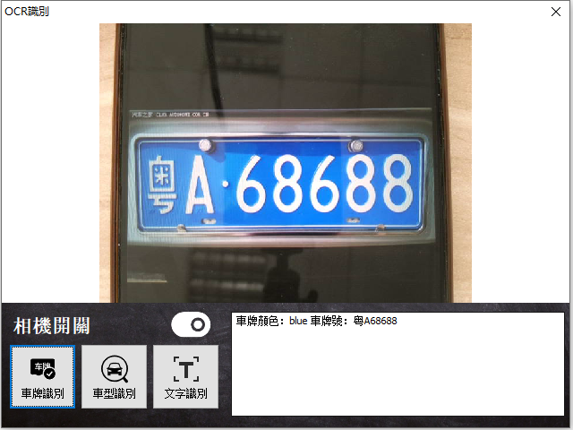

# Smart OCR 識別

Smart 智慧控制平臺，實現集中監控、資訊共用、智慧控制，與 ERP 企業經營管理系統協調互動。社區版功能無差別，全部免費。

> **加入 Facebook 社團**
>
> [https://www.facebook.com/groups/isoface/](https://www.facebook.com/groups/isoface/)
> 
> **點讚追蹤 Facebook 粉絲專頁**
> 
> [https://www.facebook.com/AIOT.ERP](https://www.facebook.com/AIOT.ERP)

範例通過 WebAPI 的方式，進行圖片的識別並回傳識別結果的資訊。範例接入的是百度 OCR 的 API，目前該範例支援通用文字識別，車牌識別以及車型識別。在使用該功能前需要獲取百度智慧云 OCR 識別 API Key 與 Secret Key。

OCR（Optical Character Recognition，光學字符識別）是指電子裝置（例如掃描器或數碼相機）檢查紙上列印的字元，通過檢測暗、亮的模式確定其形狀，然後用字元識別方法將形狀翻譯成計算機文字的過程；即，針對印刷體字元，採用光學的方式將紙質文件中的文字轉換成為黑白點陣的影象檔案，並通過識別軟體將影象中的文字轉換成文字格式，供文書處理軟體進一步編輯加工的技術。通過 OCR 技術，我們可以快速獲取圖片中的資訊，從而提高效率。

通過範例學習，可以掌握攝像機獲取圖片的方式，並使 BaiduAPI 獲取圖片進行 OCR 識別的功能。

* **Smart 簡介**：https://isoface.net/isoface/production/software/smart/smart
* **Smart 下載**：[點選此處下載](https://github.com/isoface-iot/Smart/releases/latest)
* **Smart 使用手冊**：https://isoface.net/isoface/doc/smart/main/
* **範例手冊**：https://isoface.net/isoface/doc/smart/demo/ocr/
* **範例視訊**：https://isoface.net/isoface/component/k2/video-tutorial/smart/s-eq-dem-2034
* **Smart 快速上手**：https://isoface.net/isoface/study/quick-start/2022-05-28-03-08-29/smart
* **無需安裝，Smart線上試用**：https://isoface.net/isoface/support/trial/smart
## 注意事項：
1. Smart 智慧控制開發工具採用 Pascal 程序語言，開發物聯網相關運用。
2. Smart 因支援多種通訊協定與視訊處理程序，在 4K 顯示器的設計模式下，字體顯示偏小，如不適應請先調整 4K 顯示器解析度在 1920 * 1080 與 2560 * 1440 之間，不便之處敬請見諒。