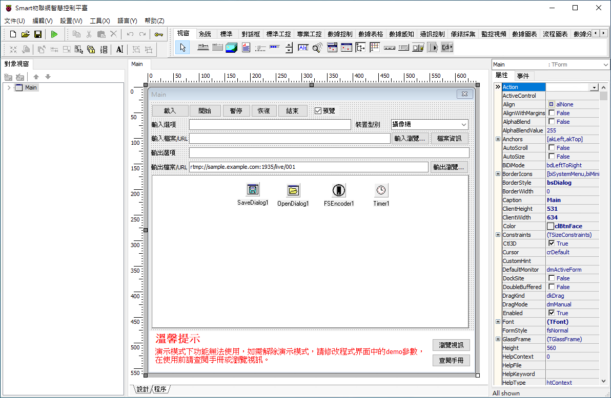
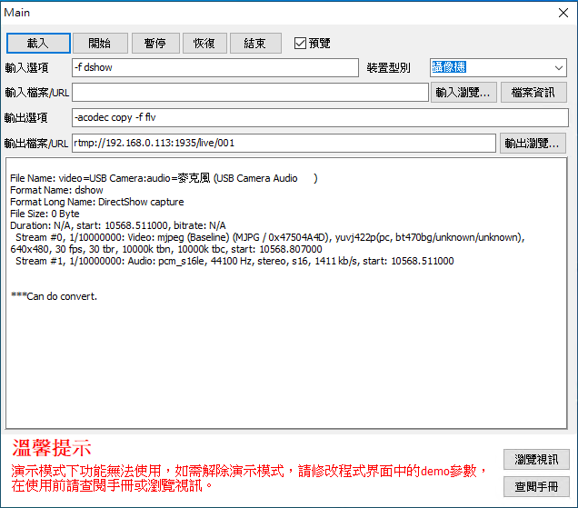
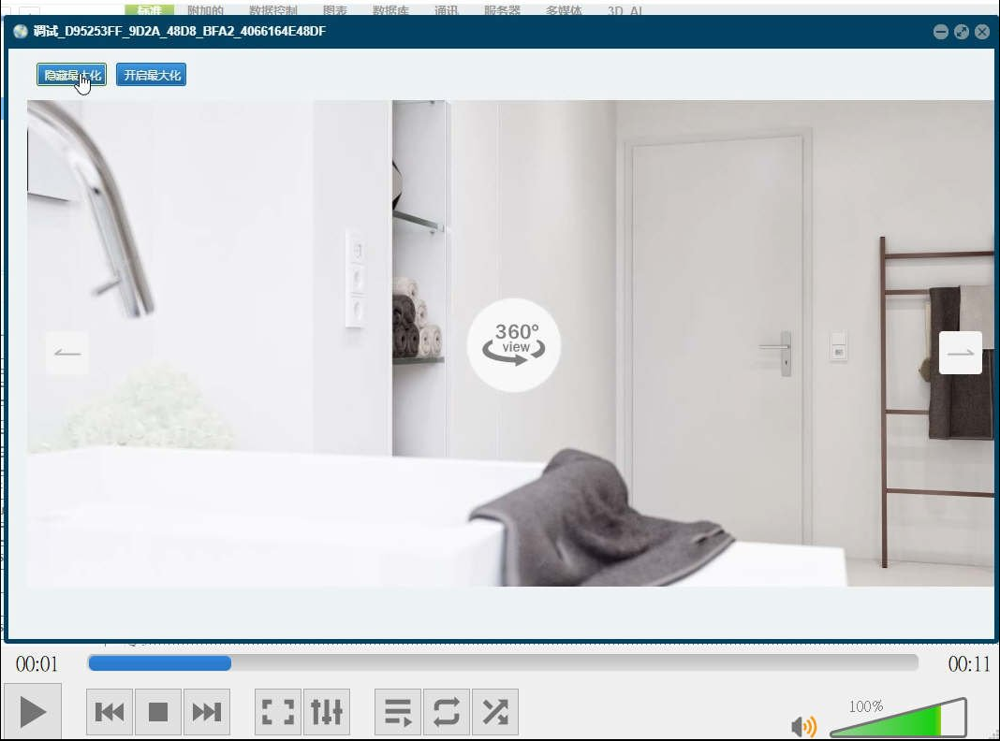

# Smart 快速開發，簡易的直播伺服器

Smart 智慧控制平臺，實現集中監控、資訊共用、智慧控制，與 ERP 企業經營管理系統協調互動。社區版功能無差別，全部免費。

> **加入 Facebook 社團**
>
> [https://www.facebook.com/groups/isoface/](https://www.facebook.com/groups/isoface/)
> 
> **點讚追蹤 Facebook 粉絲專頁**
> 
> [https://www.facebook.com/diylogi](https://www.facebook.com/diylogi)

使用 Windows 桌面軟件開發工具 Smart，快速開發，馬上使用，簡單高效的即時視訊直播伺服器，支援 RTMP 即時串流服務。使用方便無門檻，提供完整的概念和統一的設計模式，實現高效率的串流服務，個人也能快速提供全方位的直播服務，包括企業安保、工廠監控、直播企劃、直播宣傳、短影音製作，平臺同步直播串流技術。客戶群涵蓋企業、工廠、遊戲、電商、品牌、快速消費品、政府單位，提供一條龍式的服務。

**Smart 協助開發視訊直播技術**

自行開發平臺同步直播串流服務，協助客戶完成最大的宣傳效益。

**Smart 提供簡單的直播宣傳解決方案**

通過網路媒體投放，充分發揮直播活動的最大價值。

**Smart 範例有以下功能**：

1. 直接連線攝像頭，進行視訊錄製並提連線供埠進行遠端視訊檢視，立即進行攝影直播。
2. 選取攝像頭預先錄製已經拍攝好的視訊檔案，直播發送。
3. 將 Windows 電腦桌面當成直播畫面發送，可做為客戶服務、遠端教學使用。
4. 選取網頁做為直播畫面發送，作為業務宣傳、商品展示。
　　
Smart 直播伺服器提供的視訊串流服務，可使用免費軟體 VLC media player 進行瀏覽。

設計界面顯示如下。

執行界面顯示如下。在確認裝置型別與推流地址無誤的情況下，點選 `[載入]` 按鈕，當提示資訊顯示為 `Can do convert` 時，表示目前設定正確，可以進行推流，此時點選 `[開始]` 按鈕，在 VLC media player 中使用輸出的 URL 可進行視訊播放。

* **Smart 簡介**：https://isoface.net/isoface/production/software/smart/smart
* **Smart 下載**：[點選此處下載](https://github.com/isoface-iot/Smart/releases/latest)
* **範例手冊**：https://isoface.net/isoface/doc/smart/demo/live-push/
* **範例視訊**：https://isoface.net/isoface/component/k2/video-tutorial/smart/s-eq-dem-2039
* **Smart 使用手冊**：https://isoface.net/isoface/doc/smart/main/
* **Smart 快速上手**：https://isoface.net/isoface/study/quick-start/2022-05-28-03-08-29/smart
* **無需安裝，Smart線上試用**：https://isoface.net/isoface/support/trial/smart

## 注意事項：
1. Smart 智慧控制開發工具採用 Pascal 程序語言，開發物聯網相關運用。
2. Smart 因支援多種通訊協定與視訊處理程序，在 4K 顯示器的設計模式下，字體顯示偏小，如不適應請先調整 4K 顯示器解析度在 1920 * 1080 與 2560 * 1440 之間，不便之處敬請見諒。