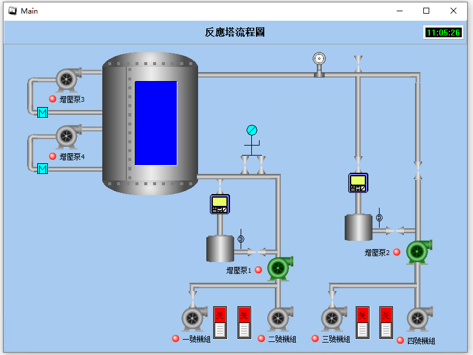

# Smart SVG 組態

Smart 智慧控制平臺，實現集中監控、資訊共用、智慧控制，與 ERP 企業經營管理系統協調互動。社區版僅供個人且非商業使用。

> **加入 Facebook 社團**
>
> [https://www.facebook.com/groups/isoface/](https://www.facebook.com/groups/isoface/)
> 
> **點讚追蹤 Facebook 粉絲專頁**
> 
> [https://www.facebook.com/AIOT.ERP](https://www.facebook.com/AIOT.ERP)

SVG是一種可縮放向量圖形，其使用 XML 來描述形狀特徵，關於 SVG 的說明等資訊可參[https://developer.mozilla.org/zh-CN/docs/Web/SVG](https://developer.mozilla.org/zh-CN/docs/Web/SVG) 。由於其向量圖的特性，在進行編輯縮放等相關操作后，圖形不失真，可廣泛用於圖形展示的場合。組態界面由於其圖形的特性，非常適合使用 SVG 來展示。

通過範例學習，可以掌握使用 SVG 來展示組態的界面，並通過控制元件來實現組態界面的動態顯示。

* **Smart 簡介**：https://isoface.net/isoface/production/software/smart/smart
* **Smart 下載**：[點選此處下載](https://github.com/isoface-iot/Smart/releases/latest)
* **Smart 使用手冊**：https://isoface.net/isoface/doc/smart/main/
* **範例手冊**：https://isoface.net/isoface/doc/smart/demo/svg-scada/
* **範例視訊**：https://isoface.net/isoface/component/k2/video-tutorial/smart/s-eq-dem-2051
* **Smart 快速上手**：https://isoface.net/isoface/study/quick-start/2022-05-28-03-08-29/smart
* **無需安裝，Smart線上試用**：https://isoface.net/isoface/support/trial/smart

## 注意事项：
1. Smart 智慧控制开发工具采用 Pascal 程序语言，开发物联网相关运用。
2. Smart 因支持多种通信协议与视频处理程序，在 4K 显示器的设计模式下，字体显示偏小，如不适应请先调整 4K 显示器分辨率在 1920 * 1080 与 2560 * 1440 之间，不便之处敬请见谅。
