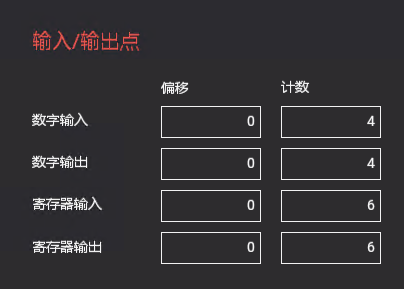
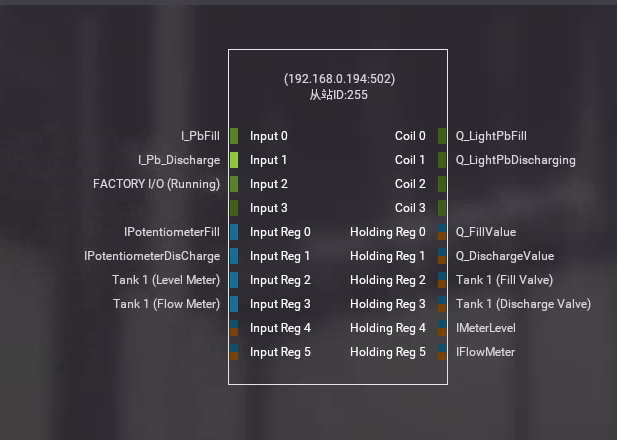
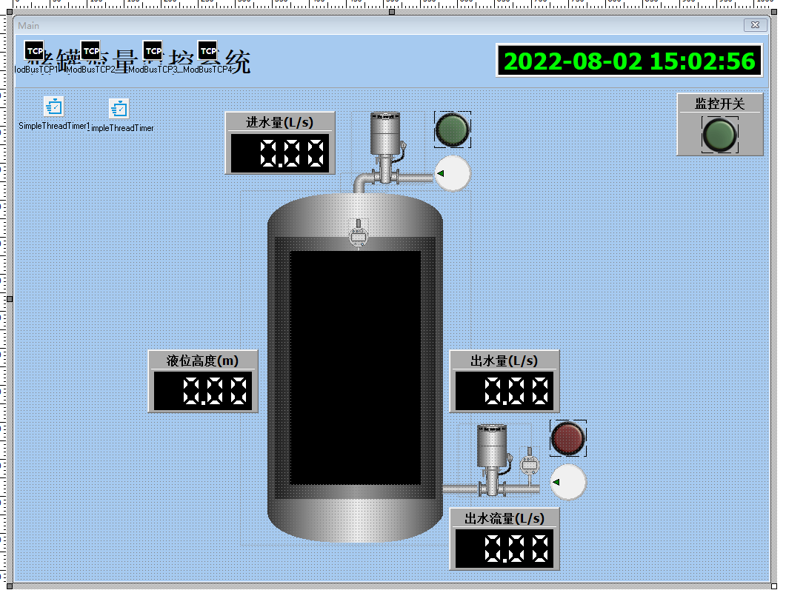
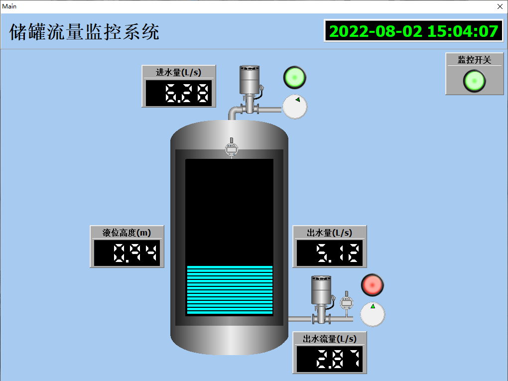

# Smart 液化水槽監控

Smart 智慧控制平臺，實現集中監控、資訊共用、智慧控制，與 ERP 企業經營管理系統協調互動。社區版功能無差別，全部免費。

> **請加入【FaceBook社團】掌握產品最新動態**
>
> [https://www.facebook.com/groups/535849751457439](https://www.facebook.com/groups/535849751457439)

Smart 可藉由ModbusTCP 讀取實際場景Modbus Slave中的數據，實現對 Factory IO 場景的控制。

PLC的全稱是可程式設計邏輯控制器（Programmable Logic Controller），是一種具有微處理機的數位電子裝置，用於自動化控制的數字邏輯控制器，在工業控制領域得到廣泛的運用。PLC 可運用於工業和家庭自動化、物聯網和 SCADA 研究。

Factory IO是一款出色的虛擬模擬軟體，可以自由使用其內部的各種元器件、感測器、驅動器等搭建自己理想中的工業現場，並聯合PLC進行程式設計模擬。

範例目錄中已提供了場景的專案檔案，可直接在Factory IO 中打開，此場景的製作方式如下：

在Factory IO 中建立一個空白場景。在工作站分類中找到 `Tank`，將其拖放至場景中，使用滑鼠右鍵點選零件，將配置修改爲 `Analog`。

接下來選擇驅動方式，點選功能表欄中的 `檔案-驅動`，在下拉框中選擇驅動的方式為 `Modbus TCP/IP Server`，點選右側的 `配置` 按鈕，將從站ID 修改爲 `255`，輸入、輸出點按照圖示進行設定。

返回驅動界面，界面中暫存器分配設定如下：

打開Smart 設計界面進行場景設計，設計完成的樣式如下：

設計關聯的事件程式碼，最終的執行狀態如下：

* **產品**：https://isoface.net/isoface/production/software/smart
* **產品說明**：https://isoface.net/isoface/doc/smart/main/
* **網址**：https://isoface.net/

## 注意事項：
1. Smart 智慧控制開發工具採用 Pascal 程序語言，開發物聯網相關運用。
2. Smart 因支援多種通訊協定與視訊處理程序，在 4K 顯示器的設計模式下，字體顯示偏小，如不適應請先調整 4K 顯示器解析度在 1920 * 1080 與 2560 * 1440 之間，不便之處敬請見諒。