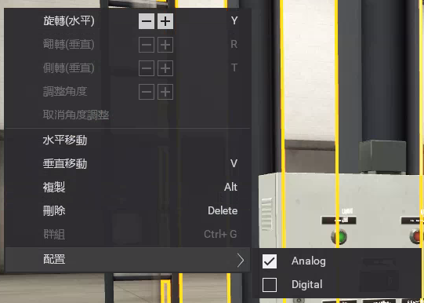
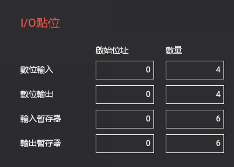
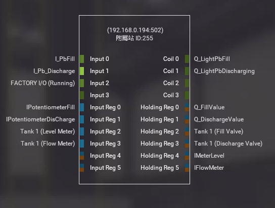
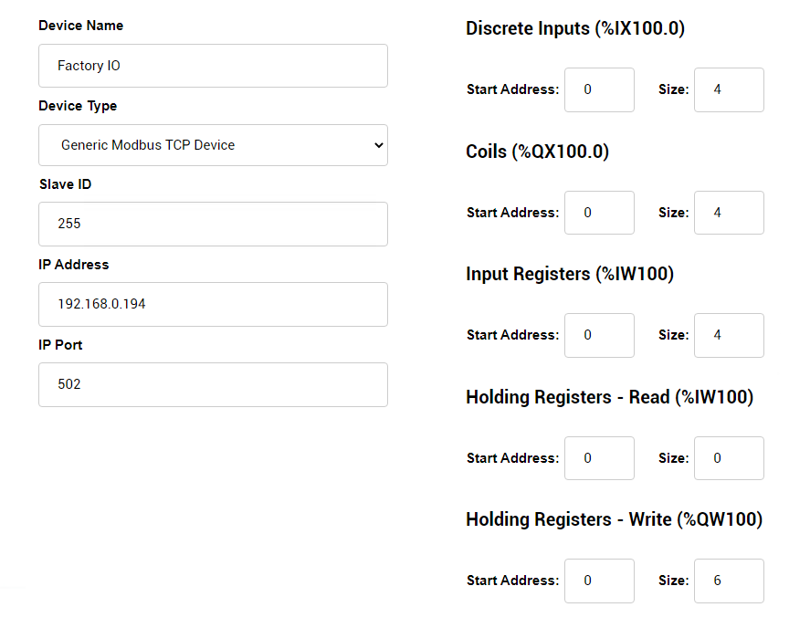

# 把 Smart 當作 PLC 直接監控液化水槽

Smart 智慧控制平臺，實現集中監控、資訊共用、智慧控制，與 ERP 企業經營管理系統協調互動。社區版非商業用途可免費使用。

> **加入 Facebook 社團**
>
> [https://www.facebook.com/groups/isoface/](https://www.facebook.com/groups/isoface/)
> 
> **點讚追蹤 Facebook 粉絲專頁**
> 
> [https://www.facebook.com/AIOT.ERP](https://www.facebook.com/AIOT.ERP)

**Smart 當作 PLC 模擬控制 Factory I/O 控制水槽，包括兩個部分**

1. Smart 萬物精靈，軟件開發工具，可作為 PLC 對虛擬工廠進行監測與控制，同時作為 HMI 與 SCADA 的設計工具，直接監控與其連線的裝置。
2. Factory I/O 數位模擬控制軟體，將電腦變成 PLC 訓練平臺，使用內建工業物件，包括感測器、輸送帶、電梯等，建立虛擬工廠。可與多種 PLC 整合。

**Smart模擬控制水槽範例說明**

Factory I/O 是經濟又實惠的 3D 監控軟體，Smart 設計者可透過不同視角導航，瞭解工廠裝置與感測器之間的互動關係。還可利用Modbus TCP、OPC DA 等工業通訊協定，模擬 PLC 自動控制。隨著工業 4.0不斷的發展，Smart 利用 Factory I/O模擬工廠的作業環境，與實際環工作境融合在一起。將可程式化控制器(PLC)，以簡易視覺化方法，完成設定作業。

Smart 使用 ModbusTCP 通訊協議，可讀取 Factory I/O的控制數據，實現對 Factory I/O 虛擬工廠的控制。Factory I/O是虛擬模擬軟體，可使用其內部的各種元器件、感測器、驅動器等搭建自己理想中的工業現場，並聯合 PLC 模擬進行程式設計模擬。範例提供場景的專案檔案，可直接在Factory I/O 執行，此場景的製作方式如下：

在Factory I/O 中建立一個空白場景。在工作站分類中找到 `Tank`，將其拖放至場景中，使用滑鼠右鍵點選零件，將配置修改爲 `Analog`。

接下來選擇驅動方式，點選功能表欄中的 `專案-控制器`，在下拉框中選擇驅動的方式為 `Modbus TCP/IP Server`，點選右側的 `配置` 按鈕，將附屬站ID 修改爲 `255`，輸入、輸出點按照圖示進行設定。

返回驅動界面，界面中暫存器分配設定如下：

打開OpenPLC管理後臺界面，選擇 `Slave Devices`，在列表界面中點選 `Add new device`，建立的裝置根據 Factory IO 中的驅動地址進行修改。

設定完成後，點選 `Save device` 儲存。

1. Factory I/O 場景專案檔案位於 `factoryio` 目錄中。

* **Smart 簡介**：https://isoface.net/isoface/production/software/smart/smart
* **Smart 下載**：[點選此處下載](https://github.com/isoface-iot/Smart/releases/latest)
* **Smart 使用手冊**：https://isoface.net/isoface/doc/smart/main/
* **Smart 快速上手**：https://isoface.net/isoface/study/quick-start/2022-05-28-03-08-29/smart
* **無需安裝，Smart線上試用**：https://isoface.net/isoface/support/trial/smart

## 注意事項：
1. Smart 智慧控制開發工具採用 Pascal 程序語言，開發物聯網相關運用。
2. Smart 因支援多種通訊協定與視訊處理程序，在 4K 顯示器的設計模式下，字體顯示偏小，如不適應請先調整 4K 顯示器解析度在 1920 * 1080 與 2560 * 1440 之間，不便之處敬請見諒。