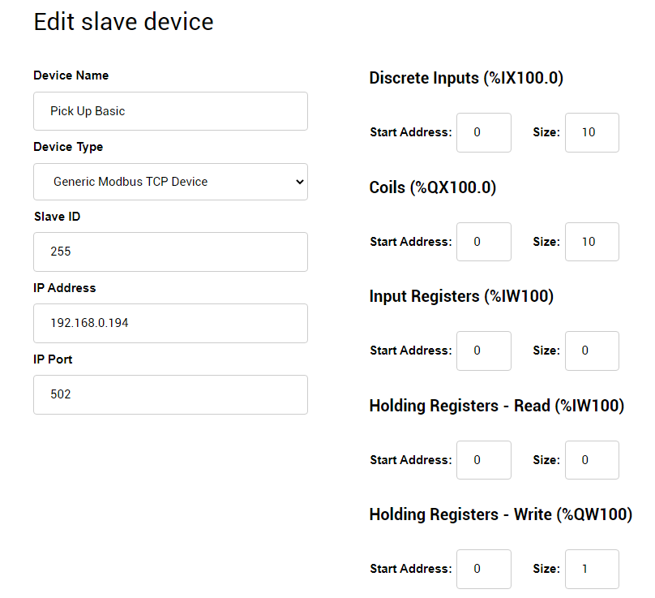
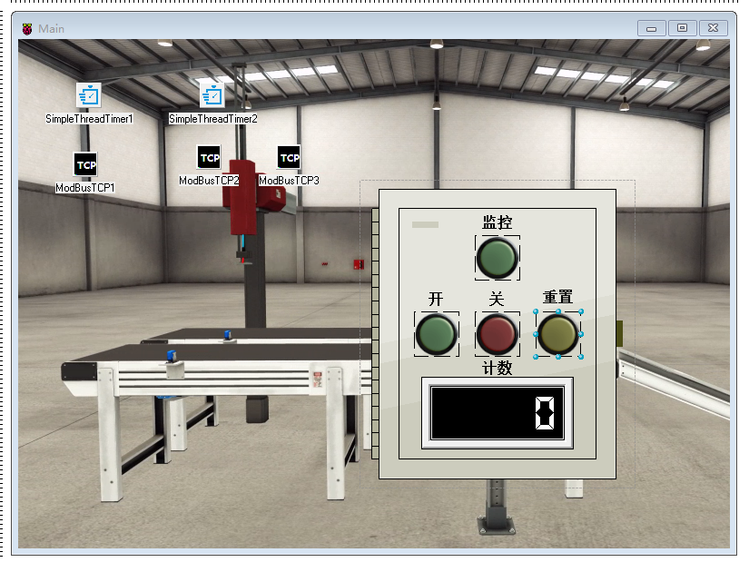
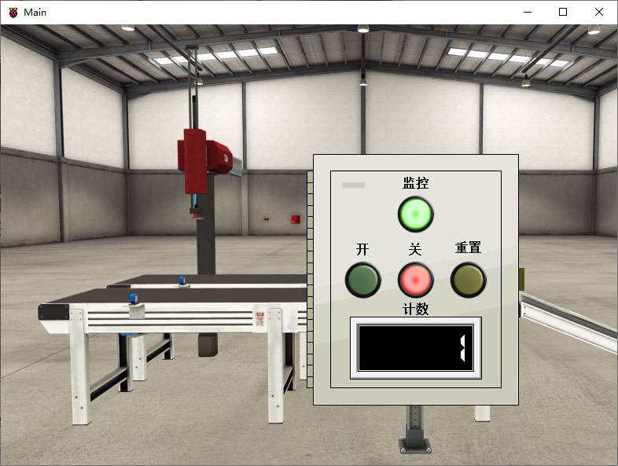

# Smart 工業手臂抓取物件

Smart 智慧控制平臺，實現集中監控、資訊共用、智慧控制，與 ERP 企業經營管理系統協調互動。社區版功能無差別，全部免費。

> **請加入【物聯網、智聯網、ERP、視訊、監控，快速整合開發】社團，掌握產品最新動態**
>
> [https://www.facebook.com/groups/535849751457439](https://www.facebook.com/groups/535849751457439)

Smart 可藉由ModbusTCP 讀取OpenPLC中的數據，實現對 Factory IO 場景的控制。

PLC的全稱是可程式設計邏輯控制器（Programmable Logic Controller），是一種具有微處理機的數位電子裝置，用於自動化控制的數字邏輯控制器，在工業控制領域得到廣泛的運用。OpenPLC 是一款易於使用的開源可程式設計邏輯控制器（Programmable Logic Controller, 簡稱 PLC），根據 IEC 61131-3 標準所建立，該標準定義了 PLC 基本的軟體架構和程式語言。OpenPLC 主要使用於工業和家庭自動化、物聯網和 SCADA 研究。

Factory IO是一款出色的虛擬模擬軟體，可以自由使用其內部的各種元器件、感測器、驅動器等搭建自己理想中的工業現場，並聯合PLC進行程式設計模擬。

範例目錄中已提供了場景的專案檔案，可直接在Factory IO 中打開，此場景的製作方式如下：

在Fasctory IO 中建立示例場景 `Pick & Place Basic`，將機械臂下方的 `Item at entry` 標籤的感測器移動位置，使其感應區域與機械臂處於同一垂直面中。否則在實際執行時會出現機械臂難以抓取物件的情況。

接下來選擇驅動方式，點選功能表欄中的 `檔案-驅動`，在下拉框中選擇驅動的方式為 `Modbus TCP/IP Server`，點選右側的 `配置` 按鈕，將從站ID 修改爲 `255`。

返回驅動界面，界面中暫存器分配設定可保持場景的預設設定。

打開OpenPLC管理後臺界面，選擇 `Slave Devices`，在列表界面中點選 `Add new device`，建立的裝置根據 Factory IO 中的驅動地址進行修改。

設定完成後，點選 `Save device` 儲存。

接下來上傳PLC程式，將專案檔案 `Pick&Place_Basic.zip` 解壓縮。OpenPLC管理後臺界面選擇 `Programs`，選擇上傳其中的 `*.st` 檔案，上傳並儲存，OpenPLC將重新編譯程式，編譯完成後，返回主界面，並點選 `Start PLC` 啟動PLC。

OpenPLC啟動后，可點選場景執行，測試執行情況。

打開Smart 設計界面進行場景設計，設計完成的樣式如下：

設計關聯的事件程式碼，最終的執行狀態如下：

1. Factory I/O 場景專案檔案位於 `factoryio` 目錄中。
2. OpenPLC 程式專案檔案位於 `openplc` 目錄中。請使用 OpenPLC Editor 編輯。

* **產品**：https://isoface.net/isoface/production/software/smart
* **產品說明**：https://isoface.net/isoface/doc/smart/main/
* **網址**：https://isoface.net/

## 注意事項：
1. Smart 智慧控制開發工具採用 Pascal 程序語言，開發物聯網相關運用。
2. Smart 因支援多種通訊協定與視訊處理程序，在 4K 顯示器的設計模式下，字體顯示偏小，如不適應請先調整 4K 顯示器解析度在 1920 * 1080 與 2560 * 1440 之間，不便之處敬請見諒。